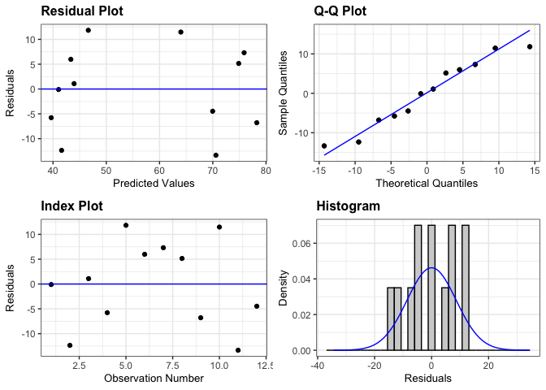
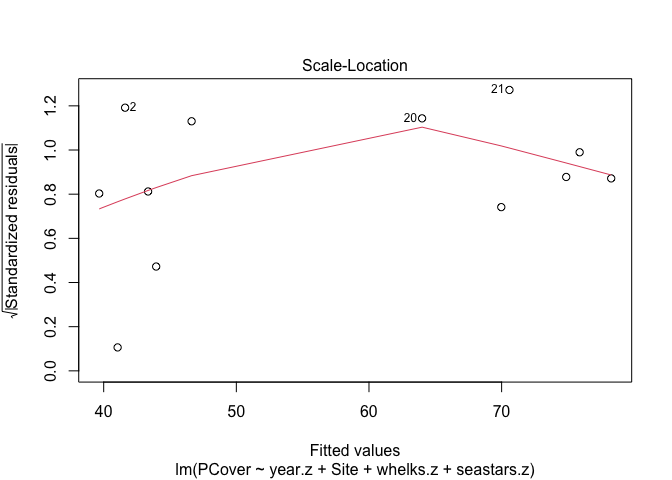
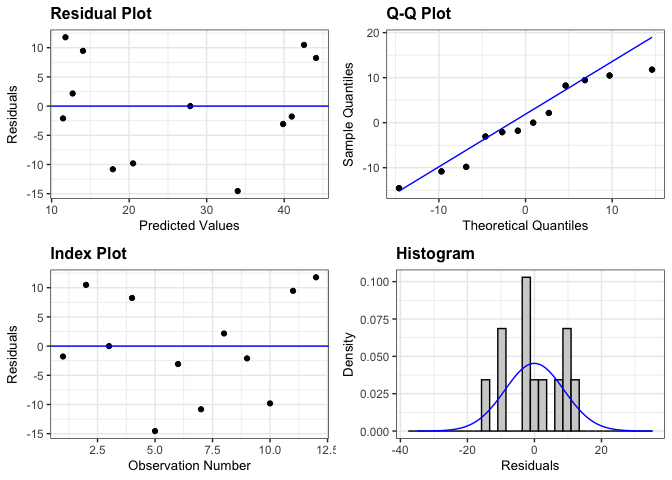
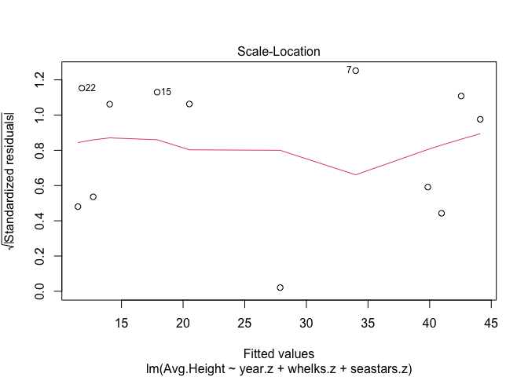
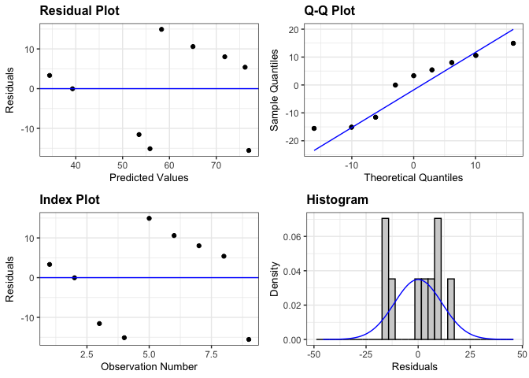
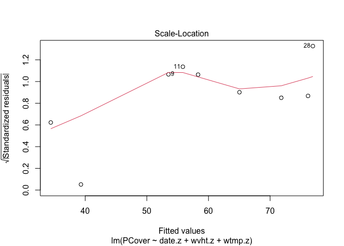
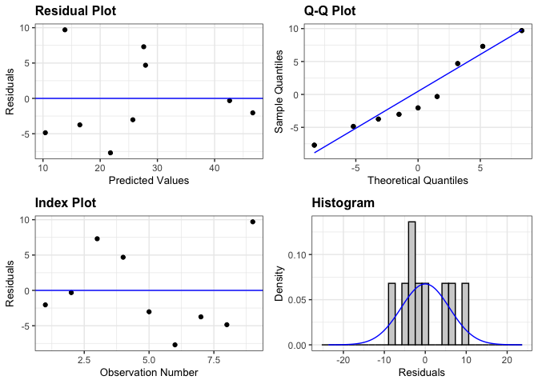
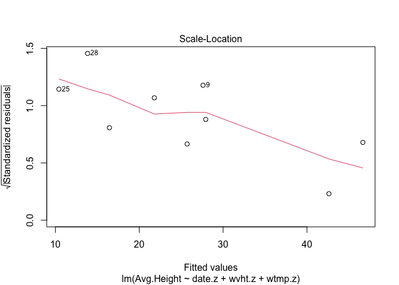

Models
================
Micaela Chapuis
2024-07-16

``` r
library(here)
```

    ## here() starts at /Users/micachapuis/GitHub/Recent_changes_in_mussel_beds_following_mass_mortality_of_a_keystone_marine_predator

``` r
library(tidyverse)
```

    ## ── Attaching core tidyverse packages ──────────────────────── tidyverse 2.0.0 ──
    ## ✔ dplyr     1.1.4     ✔ readr     2.1.5
    ## ✔ forcats   1.0.0     ✔ stringr   1.5.1
    ## ✔ ggplot2   3.5.1     ✔ tibble    3.2.1
    ## ✔ lubridate 1.9.4     ✔ tidyr     1.3.1
    ## ✔ purrr     1.0.2

    ## ── Conflicts ────────────────────────────────────────── tidyverse_conflicts() ──
    ## ✖ dplyr::filter() masks stats::filter()
    ## ✖ dplyr::lag()    masks stats::lag()
    ## ℹ Use the conflicted package (<http://conflicted.r-lib.org/>) to force all conflicts to become errors

``` r
library(lubridate)
library(broom)
library(ggResidpanel)
library(car)
```

    ## Loading required package: carData
    ## 
    ## Attaching package: 'car'
    ## 
    ## The following object is masked from 'package:dplyr':
    ## 
    ##     recode
    ## 
    ## The following object is masked from 'package:purrr':
    ## 
    ##     some

``` r
mussel_cover_yearly_avg <- read.csv(here("Data", "Data for Models", "mussel_cover_yearly_avg.csv"))
mussel_height_yearly_avg <- read.csv(here("Data", "Data for Models", "mussel_height_yearly_avg.csv"))

mussels <- read.csv(here("Data", "Data for Models", "mussels.csv"))
mussels_B <- read.csv(here("Data", "Data for Models", "mussels_B.csv"))

seastars_avg <- read.csv(here("Data", "Data for Models", "seastars_avg.csv"))
whelks_avg <- read.csv(here("Data", "Data for Models", "whelks_avg.csv"))

wavedata <- read.csv(here("Data", "wavedata.csv"))
```

## Biotic Factors

### Mussel Cover + Predators

Joining the data sets

``` r
mussel_cover_predators <- left_join(mussel_cover_yearly_avg, seastars_avg, by=c("Year", "Site"))
mussel_cover_predators <- left_join(mussel_cover_predators, whelks_avg, by=c("Year", "Site"))
```

Centering and standardizing predictors. This function will standardize
the data by default unless indicated with “scale = FALSE”

``` r
mussel_cover_predators$whelks.z <- as.numeric(scale(mussel_cover_predators$Num.Whelks))
mussel_cover_predators$seastars.z <- as.numeric(scale(mussel_cover_predators$Num.Seastars))
mussel_cover_predators$year.z <- as.numeric(scale(mussel_cover_predators$Year))
```

###### Model

``` r
cover.pred.model <- lm(PCover ~ year.z +Site + whelks.z + seastars.z, data = mussel_cover_predators)

summary(cover.pred.model)
```

    ## 
    ## Call:
    ## lm(formula = PCover ~ year.z + Site + whelks.z + seastars.z, 
    ##     data = mussel_cover_predators)
    ## 
    ## Residuals:
    ##     Min      1Q  Median      3Q     Max 
    ## -13.334  -6.029   0.492   6.316  11.829 
    ## 
    ## Coefficients:
    ##             Estimate Std. Error t value Pr(>|t|)    
    ## (Intercept)   59.631      4.688  12.719  4.3e-06 ***
    ## year.z        10.089      2.764   3.650  0.00818 ** 
    ## SiteWest      -4.074      7.336  -0.555  0.59593    
    ## whelks.z       6.892      3.698   1.863  0.10468    
    ## seastars.z     1.274      4.187   0.304  0.76982    
    ## ---
    ## Signif. codes:  0 '***' 0.001 '**' 0.01 '*' 0.05 '.' 0.1 ' ' 1
    ## 
    ## Residual standard error: 10.81 on 7 degrees of freedom
    ##   (10 observations deleted due to missingness)
    ## Multiple R-squared:  0.7728, Adjusted R-squared:  0.6429 
    ## F-statistic: 5.951 on 4 and 7 DF,  p-value: 0.02072

``` r
tidy(cover.pred.model)
```

    ## # A tibble: 5 × 5
    ##   term        estimate std.error statistic    p.value
    ##   <chr>          <dbl>     <dbl>     <dbl>      <dbl>
    ## 1 (Intercept)    59.6       4.69    12.7   0.00000430
    ## 2 year.z         10.1       2.76     3.65  0.00818   
    ## 3 SiteWest       -4.07      7.34    -0.555 0.596     
    ## 4 whelks.z        6.89      3.70     1.86  0.105     
    ## 5 seastars.z      1.27      4.19     0.304 0.770

``` r
resid_panel(cover.pred.model)
```

<!-- -->

``` r
plot(cover.pred.model, 3)
```

<!-- -->

``` r
ncvTest(cover.pred.model)
```

    ## Non-constant Variance Score Test 
    ## Variance formula: ~ fitted.values 
    ## Chisquare = 0.02353997, Df = 1, p = 0.87806

### Mussel Height + Predators

``` r
mussel_height_predators <- left_join(mussel_height_yearly_avg, seastars_avg, by=c("Year", "Site"))
mussel_height_predators <- left_join(mussel_height_predators, whelks_avg, by=c("Year", "Site"))
```

Centering and standardizing predictors. This function will standardize
the data by default unless indicated with “scale = FALSE”

``` r
mussel_height_predators$whelks.z <- as.numeric(scale(mussel_height_predators$Num.Whelks))
mussel_height_predators$seastars.z <- as.numeric(scale(mussel_height_predators$Num.Seastars))
mussel_height_predators$year.z <- as.numeric(scale(mussel_height_predators$Year))
```

<!-- ###### Model -->

``` r
height.pred.model <- lm(Avg.Height ~ year.z + whelks.z + seastars.z, data = mussel_height_predators)

summary(height.pred.model)
```

    ## 
    ## Call:
    ## lm(formula = Avg.Height ~ year.z + whelks.z + seastars.z, data = mussel_height_predators)
    ## 
    ## Residuals:
    ##     Min      1Q  Median      3Q     Max 
    ## -14.548  -4.756  -0.890   8.547  11.788 
    ## 
    ## Coefficients:
    ##             Estimate Std. Error t value Pr(>|t|)    
    ## (Intercept)   26.027      2.995   8.691 2.39e-05 ***
    ## year.z        -9.317      2.629  -3.544  0.00758 ** 
    ## whelks.z      -4.501      3.518  -1.280  0.23657    
    ## seastars.z    -5.340      3.426  -1.558  0.15774    
    ## ---
    ## Signif. codes:  0 '***' 0.001 '**' 0.01 '*' 0.05 '.' 0.1 ' ' 1
    ## 
    ## Residual standard error: 10.33 on 8 degrees of freedom
    ##   (10 observations deleted due to missingness)
    ## Multiple R-squared:  0.6914, Adjusted R-squared:  0.5757 
    ## F-statistic: 5.976 on 3 and 8 DF,  p-value: 0.01935

``` r
tidy(height.pred.model)
```

    ## # A tibble: 4 × 5
    ##   term        estimate std.error statistic   p.value
    ##   <chr>          <dbl>     <dbl>     <dbl>     <dbl>
    ## 1 (Intercept)    26.0       2.99      8.69 0.0000239
    ## 2 year.z         -9.32      2.63     -3.54 0.00758  
    ## 3 whelks.z       -4.50      3.52     -1.28 0.237    
    ## 4 seastars.z     -5.34      3.43     -1.56 0.158

``` r
resid_panel(height.pred.model)
```

<!-- -->

``` r
plot(height.pred.model, 3)
```

<!-- -->

``` r
ncvTest(height.pred.model)
```

    ## Non-constant Variance Score Test 
    ## Variance formula: ~ fitted.values 
    ## Chisquare = 0.0009687155, Df = 1, p = 0.97517

## Abiotic Factors

``` r
wavedata$Date <- as.Date(wavedata$Date)
wavedata$Year <- year(wavedata$Date)
```

Rename WVHT and WTMP

``` r
wavedata <- wavedata %>% rename("Wave.Height" = "WVHT",
                                "Water.Temp" = "WTMP")
```

Function to calculate average of any variable (here WVHT and WTMP) for a
given interval (here we want to take the date of mussel data collection
and calculate the average of the variable for the 3 months before that
day)

``` r
calculate_average_variable <- function(end_date, data, variable) {
  
  # Convert the end date to date format
  end_date <- as.Date(end_date)
  
  # Find the start date of the interval by subtracting 3 months from the end date
  start_date <- as.Date(end_date - months(3))
  
  # Create sequence of dates between start and end dates
  date_sequence <- seq(from = start_date, to = end_date, by = "days")
  
  # Subset data to only include rows for dates in the interval
  data_subset <- data[data$Date %in% date_sequence,]
  
  # Calculate average of the variable for the interval
  average_variable <- mean(data_subset[[variable]])
  
  # Return the average of the variable
  return(average_variable)
}
```

<!-- #### Mussel Cover -->

Make new df “mussels.abiotic” with the same data as mussels + will add
wave data

``` r
mussels.abiotic <- mussels
```

Loop through mussel data (mussels) and calculate average Wave.Height for
each date + add it to mussels.abiotic

``` r
for (i in 1:nrow(mussels)) {
  # Get end date from mussels
  end_date <- mussels[i, "Date"]
  # Calculate average wave height for interval
  average_waveheight <- calculate_average_variable(end_date, wavedata, "Wave.Height")
  # Store result in mussels
  mussels.abiotic[i, "Wave.Height"] <- average_waveheight
}
```

Repeat with Water.Temp

``` r
for (i in 1:nrow(mussels)) {
  # Get end date from mussels
  end_date <- mussels[i, "Date"]
  # Calculate average water temperature for interval
  average_watertemp <- calculate_average_variable(end_date, wavedata, "Water.Temp")
  # Store result in mussels
  mussels.abiotic[i, "Water.Temp"] <- average_watertemp
}
```

``` r
mussels.abiotic <- mussels.abiotic %>% group_by(Date, Date.num, Wave.Height, Water.Temp) %>% summarize(PCover = mean(PCover))
```

    ## `summarise()` has grouped output by 'Date', 'Date.num', 'Wave.Height'. You can
    ## override using the `.groups` argument.

Making csv with the averaged wave data to make Figure 2 with the model
data

``` r
#write.csv(mussels.abiotic, file = here("Data", "Data for Models", "mussels.abiotic.csv"), row.names = FALSE)  #to use in NOAA_Wave_Data script
```

Centering and standardizing predictors. This function will standardize
the data by default unless indicated with “scale = FALSE”

``` r
mussels.abiotic$wvht.z <- as.numeric(scale(mussels.abiotic$Wave.Height))
mussels.abiotic$wtmp.z <- as.numeric(scale(mussels.abiotic$Water.Temp))
mussels.abiotic$date.z <- as.numeric(scale(mussels.abiotic$Date.num))
```

###### Model

``` r
cover.abiotic.model <- lm(PCover ~ date.z + wvht.z + wtmp.z, data = mussels.abiotic)

summary(cover.abiotic.model)
```

    ## 
    ## Call:
    ## lm(formula = PCover ~ date.z + wvht.z + wtmp.z, data = mussels.abiotic)
    ## 
    ## Residuals:
    ##        4        5        9       11       14       21       23       25 
    ##   3.3240  -0.0306 -11.5616 -15.1232  14.9279  10.5959   8.0272   5.3999 
    ##       28 
    ## -15.5595 
    ## 
    ## Coefficients:
    ##             Estimate Std. Error t value Pr(>|t|)    
    ## (Intercept)   56.379      4.951  11.388 9.14e-05 ***
    ## date.z        11.841      4.872   2.430   0.0594 .  
    ## wvht.z        -2.474      6.420  -0.385   0.7159    
    ## wtmp.z        -4.652      5.621  -0.828   0.4456    
    ## ---
    ## Signif. codes:  0 '***' 0.001 '**' 0.01 '*' 0.05 '.' 0.1 ' ' 1
    ## 
    ## Residual standard error: 14.45 on 5 degrees of freedom
    ##   (19 observations deleted due to missingness)
    ## Multiple R-squared:  0.639,  Adjusted R-squared:  0.4225 
    ## F-statistic: 2.951 on 3 and 5 DF,  p-value: 0.1372

``` r
tidy(cover.abiotic.model)
```

    ## # A tibble: 4 × 5
    ##   term        estimate std.error statistic   p.value
    ##   <chr>          <dbl>     <dbl>     <dbl>     <dbl>
    ## 1 (Intercept)    56.4       4.95    11.4   0.0000914
    ## 2 date.z         11.8       4.87     2.43  0.0594   
    ## 3 wvht.z         -2.47      6.42    -0.385 0.716    
    ## 4 wtmp.z         -4.65      5.62    -0.828 0.446

``` r
resid_panel(cover.abiotic.model)
```

<!-- -->

``` r
plot(cover.abiotic.model, 3)
```

<!-- -->

``` r
ncvTest(cover.abiotic.model)
```

    ## Non-constant Variance Score Test 
    ## Variance formula: ~ fitted.values 
    ## Chisquare = 0.393752, Df = 1, p = 0.53033

#### Mussel Bed Height

Make new df “mussels.abiotic.B” with the same data as mussels_B + will
add wave data

``` r
mussels.abiotic.B <- mussels_B
```

Loop through mussel data (mussels) and calculate average Wave.Height for
each date + add it to mussels.abiotic

``` r
for (i in 1:nrow(mussels_B)) {
  # Get end date from mussels_B
  end_date <- mussels_B[i, "Date"]
  # Calculate average wave height for interval
  average_waveheight <- calculate_average_variable(end_date, wavedata, "Wave.Height")
  # Store result in mussels
  mussels.abiotic.B[i, "Wave.Height"] <- average_waveheight
}
```

Repeat with Water.Temp

``` r
for (i in 1:nrow(mussels_B)) {
  # Get end date from mussels
  end_date <- mussels_B[i, "Date"]
  # Calculate average water temperature for interval
  average_watertemp <- calculate_average_variable(end_date, wavedata, "Water.Temp")
  # Store result in mussels
  mussels.abiotic.B[i, "Water.Temp"] <- average_watertemp
}
```

``` r
mussels.abiotic.B <- mussels.abiotic.B %>% group_by(Date, Date.num, Wave.Height, Water.Temp) %>% summarize(Avg.Height = mean(Avg.Height))
```

    ## `summarise()` has grouped output by 'Date', 'Date.num', 'Wave.Height'. You can
    ## override using the `.groups` argument.

Centering and standardizing predictors. This function will standardize
the data by default unless indicated with “scale = FALSE”

``` r
mussels.abiotic.B$wvht.z <- as.numeric(scale(mussels.abiotic.B$Wave.Height))
mussels.abiotic.B$wtmp.z <- as.numeric(scale(mussels.abiotic.B$Water.Temp))
mussels.abiotic.B$date.z <- as.numeric(scale(mussels.abiotic.B$Date.num))
```

###### Model

``` r
height.abiotic.model <- lm(Avg.Height ~ date.z + wvht.z + wtmp.z, data = mussels.abiotic.B)

summary(height.abiotic.model)
```

    ## 
    ## Call:
    ## lm(formula = Avg.Height ~ date.z + wvht.z + wtmp.z, data = mussels.abiotic.B)
    ## 
    ## Residuals:
    ##      4      5      9     11     14     21     23     25     28 
    ## -2.045 -0.318  7.304  4.688 -3.024 -7.703 -3.745 -4.858  9.700 
    ## 
    ## Coefficients:
    ##             Estimate Std. Error t value Pr(>|t|)    
    ## (Intercept)   28.141      2.563  10.981 0.000109 ***
    ## date.z        -9.256      2.522  -3.670 0.014441 *  
    ## wvht.z         3.847      3.323   1.157 0.299370    
    ## wtmp.z         5.031      2.909   1.729 0.144342    
    ## ---
    ## Signif. codes:  0 '***' 0.001 '**' 0.01 '*' 0.05 '.' 0.1 ' ' 1
    ## 
    ## Residual standard error: 7.481 on 5 degrees of freedom
    ##   (19 observations deleted due to missingness)
    ## Multiple R-squared:  0.8121, Adjusted R-squared:  0.6994 
    ## F-statistic: 7.204 on 3 and 5 DF,  p-value: 0.029

``` r
tidy(height.abiotic.model)
```

    ## # A tibble: 4 × 5
    ##   term        estimate std.error statistic  p.value
    ##   <chr>          <dbl>     <dbl>     <dbl>    <dbl>
    ## 1 (Intercept)    28.1       2.56     11.0  0.000109
    ## 2 date.z         -9.26      2.52     -3.67 0.0144  
    ## 3 wvht.z          3.85      3.32      1.16 0.299   
    ## 4 wtmp.z          5.03      2.91      1.73 0.144

``` r
resid_panel(height.abiotic.model)
```

<!-- -->

``` r
plot(height.abiotic.model, 3)
```

<!-- -->

``` r
ncvTest(height.abiotic.model)
```

    ## Non-constant Variance Score Test 
    ## Variance formula: ~ fitted.values 
    ## Chisquare = 1.166986, Df = 1, p = 0.28002
