Mussels Plots
================
Micaela Chapuis
2024-07-10

``` r
library(here)
```

    ## here() starts at /Users/micachapuis/GitHub/Recent_changes_in_mussel_beds_following_mass_mortality_of_a_keystone_marine_predator

``` r
library(tidyverse)
```

    ## ── Attaching core tidyverse packages ──────────────────────── tidyverse 2.0.0 ──
    ## ✔ dplyr     1.1.4     ✔ readr     2.1.5
    ## ✔ forcats   1.0.0     ✔ stringr   1.5.1
    ## ✔ ggplot2   3.5.1     ✔ tibble    3.2.1
    ## ✔ lubridate 1.9.4     ✔ tidyr     1.3.1
    ## ✔ purrr     1.0.2

    ## ── Conflicts ────────────────────────────────────────── tidyverse_conflicts() ──
    ## ✖ dplyr::filter() masks stats::filter()
    ## ✖ dplyr::lag()    masks stats::lag()
    ## ℹ Use the conflicted package (<http://conflicted.r-lib.org/>) to force all conflicts to become errors

``` r
library(lubridate)
library(mgcv)
```

    ## Loading required package: nlme
    ## 
    ## Attaching package: 'nlme'
    ## 
    ## The following object is masked from 'package:dplyr':
    ## 
    ##     collapse
    ## 
    ## This is mgcv 1.9-1. For overview type 'help("mgcv-package")'.

### Mussel Plots Data

#### Data Cleaning

Load in Mussel Data

``` r
mussels <- read.csv(here("Data", "mussel_data.csv"))
```

When extracting the bed height data from pictures, if there wasn’t a
clump of 20 or more mussels at the 10 cm intervals where we took the
measurements, then it was marked as NA. But then a lot of data
(especially early data) would be excluded from figures and models.

If we didn’t have the overlap between A and B plots, we would add up the
height of the entire B plot (60 cm) plus the height measurement until a
mussel clump in the A plot. But because of the plot overlap (and because
it is always different), we decided that the most consistent way of
dealing with this is to change the NAs to 60 cm, which is the height of
the quadrat. (This makes the data censored because the actual limit of
the beds could be outside of the quadrat, that will be dealt with later
on)

We have to do it this early on in the script because we should do it for
each of the 9 bed height measurements for each quadrat. Once we replace
all the NAs, we should calculate the Avg. Height for each plot (each
row) again.

``` r
# goes through the columns with the measurements every 10cm and if there is an NA it will be replaced with the value 60
cols <- c("M1..0", "M2..10", "M3..20", "M4..30", "M5..40", "M6..50", "M7..60", "M8..70", "M9..80")
mussels <- mussels %>% mutate(across(cols, ~ replace(., is.na(.), 60)))
```

    ## Warning: There was 1 warning in `mutate()`.
    ## ℹ In argument: `across(cols, ~replace(., is.na(.), 60))`.
    ## Caused by warning:
    ## ! Using an external vector in selections was deprecated in tidyselect 1.1.0.
    ## ℹ Please use `all_of()` or `any_of()` instead.
    ##   # Was:
    ##   data %>% select(cols)
    ## 
    ##   # Now:
    ##   data %>% select(all_of(cols))
    ## 
    ## See <https://tidyselect.r-lib.org/reference/faq-external-vector.html>.

``` r
#take the new average of the values in the individual measurement columns (columns 6 through 14) and store them in Avg.Height
mussels$Avg.Height <- rowMeans(mussels[ , c(6:14)], na.rm = TRUE)
```

Changing column names

``` r
# Change name of 4th and 5th columns of mussels
names(mussels)[4] <- "Area"
names(mussels)[5] <- "PCover"
```

Get rid of extra columns

``` r
# since I already calculated the Avg.Height for each plot, I'm getting rid of the columns with the 9 measurements per plot because we won't use them
mussels <- mussels %>% select(Date, Plot, Site, Area, PCover, Avg.Height)
```

Make Avg.Height column into an integer

``` r
mussels$Avg.Height <- as.numeric(mussels$Avg.Height)
```

Dates are weird from the spreadsheet Recode dates from Mon-Yr to yr/mm

``` r
mussels$Date <- dplyr::recode(mussels$Date, "Aug-14" = "2014/08/01", "Aug-16" = "2016/08/01", "Aug-17" = "2017/08/01", "Aug-18" = "2018/08/01", "Dec-14" = "2014/12/01", "Dec-15" = "2015/12/01", "Dec-16" = "2016/12/01", "Dec-17" = "2017/12/01", "Dec-18" = "2018/12/01", "Dec-19" = "2019/12/01", "Jul-14" = "2014/07/01", "Jul-15" = "2015/07/01", "Jul-18" = "2018/07/01", "Jul-19" = "2019/07/01", "Jun-14" = "2014/06/01", "Jun-20" = "2020/06/01", "Mar-15" = "2015/03/01", "Mar-16" = "2016/03/01", "Mar-17" = "2017/03/01", "Mar-18" = "2018/03/01", "Mar-19" = "2019/03/01", "Mar-20" = "2020/03/01", "Mar-21" = "2021/03/01", "Nov-21" = "2021/11/01", "Dec-22" = "2022/12/01", "May-23" = "2023/05/27", "Dec-23" = "2023/12/12", "Mar-24" = "2024/03/07")
```

Turn Date into Date format (Year-month-day)

``` r
mussels$Date <- as.Date(mussels$Date, "%Y/%m/%d")
```

Create a Year column

``` r
mussels$Year <- year(mussels$Date)
```

Add a column for WholePlot (just number, no plot letter, called Location
in the paper) + convert WholePlot to numeric

``` r
mussels[,"WholePlot"] <- NA 
mussels$WholePlot <- str_sub(mussels$Plot, 1, nchar(mussels$Plot)-1) #gets rid of last character, which should be the letter
mussels$WholePlot <- as.numeric(mussels$WholePlot) #was in character, make it numeric
```

Convert Site, Plot, and WholePlot into Factors

``` r
mussels$Site <- as.factor(mussels$Site)
mussels$Plot <- as.factor(mussels$Plot)
mussels$WholePlot <- as.factor(mussels$WholePlot)
```

Making Date into a continuous variable in a new column (Date.num) and
subtracting the start date (June 1st 2014) because otherwise R starts
counting from January 1st 1970
(<https://stackoverflow.com/questions/44931645/convert-date-to-continuous-variable-in-r>)

``` r
mussels <- mussels %>% mutate(Date.num = as.numeric(Date - as.Date("2014-06-01"))) 
plot(mussels$Date, mussels$Date.num) #plotting to make sure it worked
```

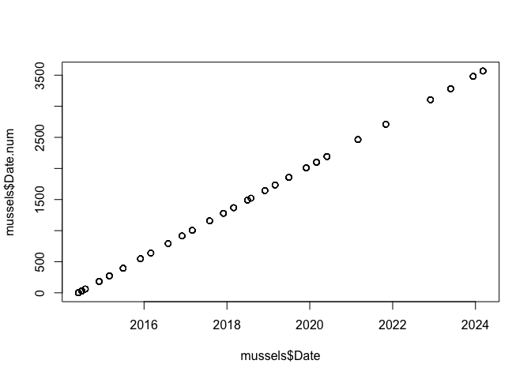<!-- -->

#### Data Decisions

Since a lot of the time, the top of the B plot overlapped with the
bottom of the A plot, we are taking the average of the A and B plots for
our Percent Cover measurements, so from now on we use WholePlot for
PCover data.

``` r
mussels_wholeplot <- mussels %>% group_by(Date, Site, WholePlot, Date.num, Year) %>% summarize(PCover = mean(PCover))
```

    ## `summarise()` has grouped output by 'Date', 'Site', 'WholePlot', 'Date.num'.
    ## You can override using the `.groups` argument.

Due to the plot overlap, we decided to use data from only B plots for
Bed Height measurements, so making a column that just has the plot
letter and making a df with just the B plots. But also Plots 4 and 8
don’t have B plots, so 4A and 8A need to be included in this new df as
well.

``` r
#subsets out the last character in the "Plot" string, which should always be the plot letter (A or B) and stores it in new column
mussels$Letter <-  str_sub(mussels$Plot, -1)

# only keeping the B plots and plots 4A and 8A
mussels_B <- mussels %>% filter((Letter %in% "B") | (WholePlot == 4) | (WholePlot == 8))
```

## Raw Data Figures

``` r
group.colors <- c(West = "#ff6361", East = "#619eff")
```

###### Fig S1A - Mussel Cover Raw Data

``` r
FigS1A <- mussels_wholeplot %>% 
  ggplot(mapping=aes(x = Date, y = PCover, color = Site)) + 
      labs (x = "Date", y = "Mussel Percent Cover") + 
      theme(panel.background = element_blank(), 
          axis.line = element_line (colour = "black"), 
          axis.text = element_text(size = 32),
                axis.text.x = element_text(angle = 0, hjust = 0.5),
          axis.title = element_text(size = 36),
          legend.position = "none") + 
      geom_point(size=4,alpha = 0.7) + 
      scale_x_date(limits = as.Date(c("2014-06-01", "2024-04-01"))) +
  scale_color_manual(values=group.colors) +
  scale_fill_manual(values=group.colors)

FigS1A
```

    ## Warning: No shared levels found between `names(values)` of the manual scale and the
    ## data's fill values.

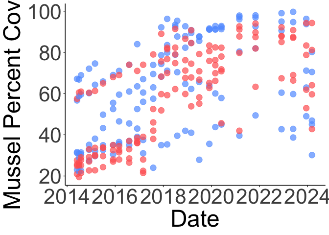<!-- -->

``` r
#ggsave(here("Figures", "figS1A.png", height=3, width=3,scale = 3))
```

\######Fig S1B - Mussel Bed Height Raw Data

``` r
FigS1B <- mussels_B %>% 
  ggplot(mapping=aes(x = Date, y = Avg.Height, color = Site)) + 
      labs (x = "Date", y = "Average Mussel Bed Height (cm)") + 
      theme(panel.background = element_blank(), 
          axis.line = element_line (colour = "black"), 
          axis.text = element_text(size = 32),
                axis.text.x = element_text(angle = 0, hjust = 0.5),
          axis.title = element_text(size = 36),
          legend.position = "none") + 
      geom_point (size = 4, alpha = 0.7) + 
    scale_x_date(limits = as.Date(c("2014-06-01", "2024-04-01"))) +
  scale_color_manual(values=group.colors) +
  scale_fill_manual(values=group.colors)

FigS1B
```

    ## Warning: No shared levels found between `names(values)` of the manual scale and the
    ## data's fill values.

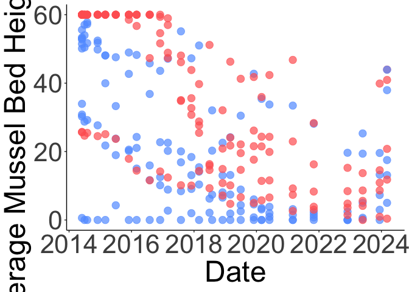<!-- -->

``` r
#ggsave("Figures", "figS1B.png", height=3, width=3,scale = 3))
```

### Models

First, we’re averaging mussel cover and mussel bed height data by Date
and Site to deal with censoring in the bed height data (see paper for
details)

``` r
mussel_cover_avg <- mussels %>% group_by(Date, Site) %>% summarize(PCover = mean(PCover))
```

    ## `summarise()` has grouped output by 'Date'. You can override using the
    ## `.groups` argument.

``` r
mussel_height_avg <- mussels_B %>% group_by(Date, Site) %>% summarize(Avg.Height = mean(Avg.Height), na.rm = TRUE)
```

    ## `summarise()` has grouped output by 'Date'. You can override using the
    ## `.groups` argument.

#### Mussel Cover Model

Converting date to decimal date

``` r
mussel_cover_avg <- mussel_cover_avg %>% mutate(date_dec = decimal_date(Date))
mussel_cover_avg
```

    ## # A tibble: 55 × 4
    ## # Groups:   Date [28]
    ##    Date       Site  PCover date_dec
    ##    <date>     <fct>  <dbl>    <dbl>
    ##  1 2014-06-01 East    40.3    2014.
    ##  2 2014-06-01 West    28.4    2014.
    ##  3 2014-07-01 East    39.6    2014.
    ##  4 2014-07-01 West    28.2    2014.
    ##  5 2014-08-01 East    40.7    2015.
    ##  6 2014-08-01 West    29.7    2015.
    ##  7 2014-12-01 East    43.9    2015.
    ##  8 2014-12-01 West    31.6    2015.
    ##  9 2015-03-01 East    45.9    2015.
    ## 10 2015-03-01 West    32.7    2015.
    ## # ℹ 45 more rows

GAMS Reference
<http://r.qcbs.ca/workshop08/book-en/introduction-to-gams.html>

Most of the code from here on was written by Robin Elahi

``` r
#practice with one subset of the data first
mussel_cover_avg_sub <- mussel_cover_avg %>% filter(Site == "West")
```

``` r
## Linear
cover.gam1 <- gam(PCover ~ date_dec, data = mussel_cover_avg_sub)
summary(cover.gam1)
```

    ## 
    ## Family: gaussian 
    ## Link function: identity 
    ## 
    ## Formula:
    ## PCover ~ date_dec
    ## 
    ## Parametric coefficients:
    ##               Estimate Std. Error t value Pr(>|t|)    
    ## (Intercept) -11704.555   1443.231  -8.110 1.83e-08 ***
    ## date_dec         5.827      0.715   8.149 1.68e-08 ***
    ## ---
    ## Signif. codes:  0 '***' 0.001 '**' 0.01 '*' 0.05 '.' 0.1 ' ' 1
    ## 
    ## 
    ## R-sq.(adj) =  0.716   Deviance explained = 72.6%
    ## GCV =  130.4  Scale est. = 120.74    n = 27

``` r
par(mfrow = c(2, 2))
gam.check(cover.gam1) # residuals exhibit curvilinear trend
```

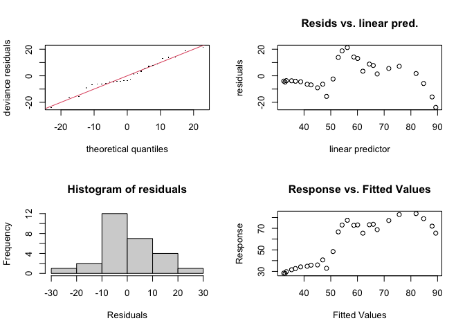<!-- -->

    ## 
    ## Method: GCV   Optimizer: magic
    ## Model required no smoothing parameter selectionModel rank =  2 / 2

``` r
fitted(cover.gam1)
```

    ##  [1] 32.41439 32.89328 33.38813 35.33561 36.77228 38.71977 41.16211 42.61212
    ##  [9] 45.04779 46.98995 48.42527 50.86761 52.81510 54.25177 56.19925 58.64159
    ## [17] 60.07826 62.02575 64.46808 65.91810 67.38268 71.73125 75.64218 81.94757
    ## [25] 84.77302 87.94965 89.31959

``` r
acf(residuals(cover.gam1)) 
```

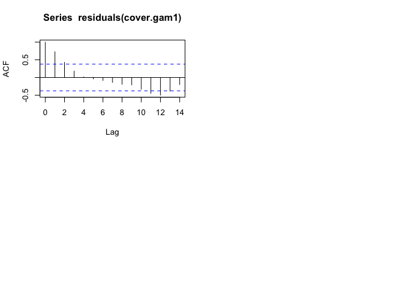<!-- -->

``` r
## Wiggly
cover.gam2 <- gam(PCover ~ s(date_dec), data = mussel_cover_avg_sub) #the s() function makes it a smoothed (non-linear) term
summary(cover.gam2) #R squared increased a lot
```

    ## 
    ## Family: gaussian 
    ## Link function: identity 
    ## 
    ## Formula:
    ## PCover ~ s(date_dec)
    ## 
    ## Parametric coefficients:
    ##             Estimate Std. Error t value Pr(>|t|)    
    ## (Intercept)  56.2138     0.6169   91.12   <2e-16 ***
    ## ---
    ## Signif. codes:  0 '***' 0.001 '**' 0.01 '*' 0.05 '.' 0.1 ' ' 1
    ## 
    ## Approximate significance of smooth terms:
    ##              edf Ref.df     F p-value    
    ## s(date_dec) 8.65  8.963 117.4  <2e-16 ***
    ## ---
    ## Signif. codes:  0 '***' 0.001 '**' 0.01 '*' 0.05 '.' 0.1 ' ' 1
    ## 
    ## R-sq.(adj) =  0.976   Deviance explained = 98.4%
    ## GCV = 15.992  Scale est. = 10.276    n = 27

``` r
plot(cover.gam2) # "The mgcv package also includes a default plot() function to look at the smooths"
```

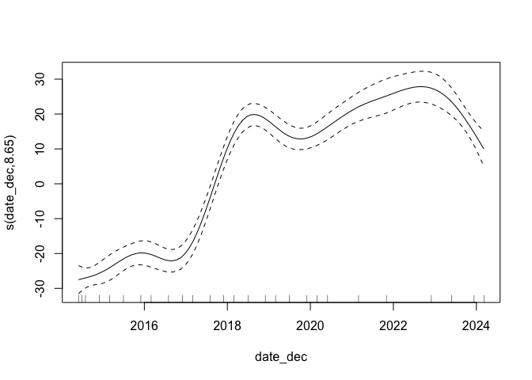<!-- -->

``` r
acf(residuals(cover.gam2)) 
```

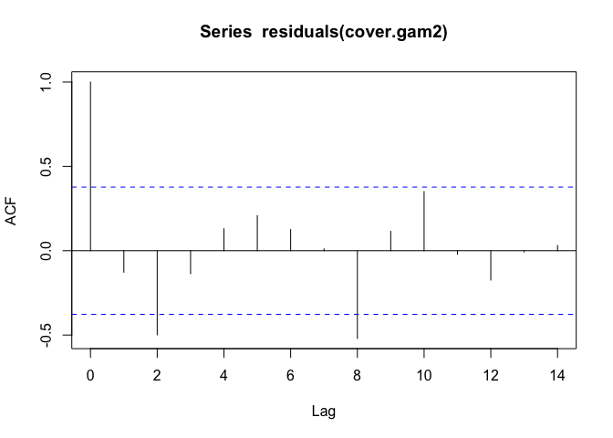<!-- -->

``` r
par(mfrow = c(2,2))
gam.check(cover.gam2)
```

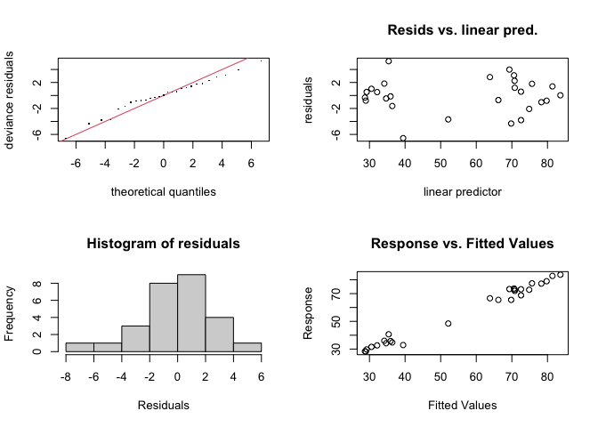<!-- -->

    ## 
    ## Method: GCV   Optimizer: magic
    ## Smoothing parameter selection converged after 7 iterations.
    ## The RMS GCV score gradient at convergence was 0.001179141 .
    ## The Hessian was positive definite.
    ## Model rank =  10 / 10 
    ## 
    ## Basis dimension (k) checking results. Low p-value (k-index<1) may
    ## indicate that k is too low, especially if edf is close to k'.
    ## 
    ##               k'  edf k-index p-value
    ## s(date_dec) 9.00 8.65    1.17    0.76

``` r
k.check(cover.gam2)
```

    ##             k'      edf  k-index p-value
    ## s(date_dec)  9 8.649724 1.169232   0.705

``` r
## Compare models - "Generally, the smaller the AIC, the “better” is the predictive performance of the model."
# Here we ask whether adding a smooth function to the linear model improves the fit of the model to our dataset.

AIC(cover.gam1, cover.gam2) # lower AIC = better performing model --> gam2 (with smoothed term) is better
```

    ##                  df      AIC
    ## cover.gam1  3.00000 209.9741
    ## cover.gam2 10.64972 148.8878

``` r
#"Here, the AIC of the smooth GAM is lower, which indicates that adding a smoothing function improves model performance. Linearity is therefore not supported by our data."
```

``` r
#"when we compare the fit of the linear (red) and non-linear (blue) models, it is clear that the blue one is more appropriate for our dataset"
mussel_cover_avg_sub %>% 
  ggplot(aes(date_dec, PCover)) + 
  geom_point(size = 3, alpha = 0.5) + 
  geom_line(aes(y = fitted(cover.gam1)), color = "red") + 
  geom_line(aes(y = fitted(cover.gam2)), color = "blue")
```

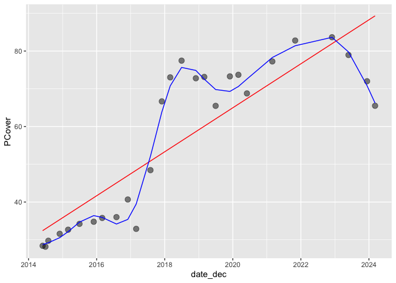<!-- -->

Now for real with all the data

``` r
mussel_cover_avg <- mussel_cover_avg %>% mutate(Site = as.factor(Site))
mussel_cover_avg
```

    ## # A tibble: 55 × 4
    ## # Groups:   Date [28]
    ##    Date       Site  PCover date_dec
    ##    <date>     <fct>  <dbl>    <dbl>
    ##  1 2014-06-01 East    40.3    2014.
    ##  2 2014-06-01 West    28.4    2014.
    ##  3 2014-07-01 East    39.6    2014.
    ##  4 2014-07-01 West    28.2    2014.
    ##  5 2014-08-01 East    40.7    2015.
    ##  6 2014-08-01 West    29.7    2015.
    ##  7 2014-12-01 East    43.9    2015.
    ##  8 2014-12-01 West    31.6    2015.
    ##  9 2015-03-01 East    45.9    2015.
    ## 10 2015-03-01 West    32.7    2015.
    ## # ℹ 45 more rows

``` r
## Trying with no interaction between date and site
cover.gam1 <- gam(PCover ~ s(date_dec) + Site, data = mussel_cover_avg, method = "ML")
gam1_summary <- summary(cover.gam1)
gam1_summary$p.table
```

    ##              Estimate Std. Error   t value     Pr(>|t|)
    ## (Intercept) 62.471223  0.9165592 68.158417 3.344605e-47
    ## SiteWest    -5.954553  1.3087768 -4.549708 4.025305e-05

``` r
gam1_summary$s.table
```

    ##                 edf   Ref.df        F p-value
    ## s(date_dec) 7.81799 8.630867 81.92602       0

``` r
par(mfrow = c(1, 2))
plot(cover.gam1, all.terms = TRUE)
```

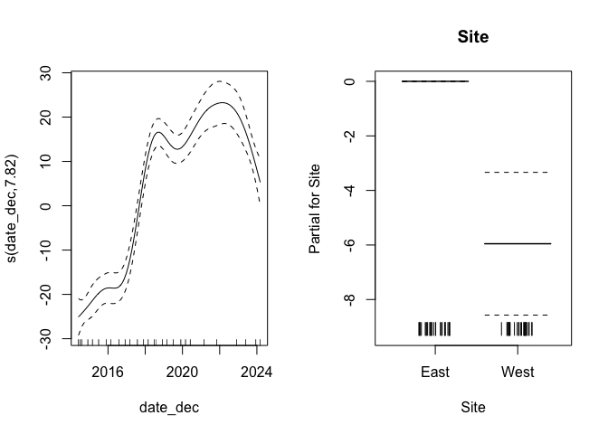<!-- -->

``` r
acf(residuals(cover.gam1)) 
```

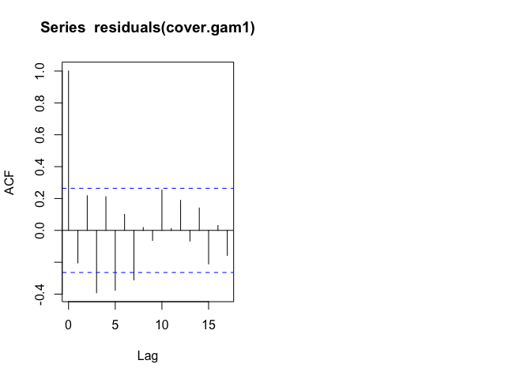<!-- -->

``` r
# USING THIS MODEL (see AIC below)
## With interaction between date and site
# https://r.qcbs.ca/workshop08/book-en/gam-with-interaction-terms.html

cover.gam2 <- gam(PCover ~ s(date_dec, by = Site) + Site, data = mussel_cover_avg, method = "ML") # this is default, thin plate regression spline
gam2_summary <- summary(cover.gam2)
gam2_summary$p.table
```

    ##              Estimate Std. Error  t value     Pr(>|t|)
    ## (Intercept) 62.520163  0.7562765 82.66839 9.458386e-45
    ## SiteWest    -5.964508  1.0795861 -5.52481 2.500817e-06

``` r
gam2_summary$s.table
```

    ##                           edf   Ref.df        F p-value
    ## s(date_dec):SiteEast 6.848418 7.938068 49.88373       0
    ## s(date_dec):SiteWest 7.883744 8.666716 77.12574       0

``` r
par(mfrow = c(2, 2))
plot(cover.gam2, all.terms = TRUE) # the first two plots show the interaction effect of the date smooth and each level of the Site factor variable.
acf(residuals(cover.gam2)) 
```

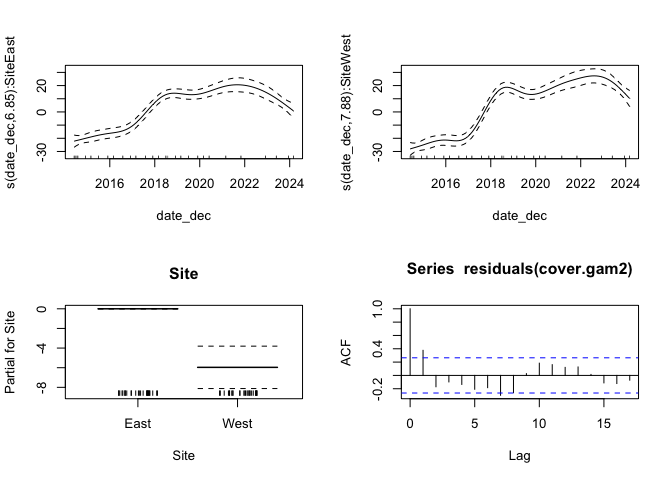<!-- -->

``` r
## Check gam
par(mfrow = c(2, 2))
gam.check(cover.gam2)
```

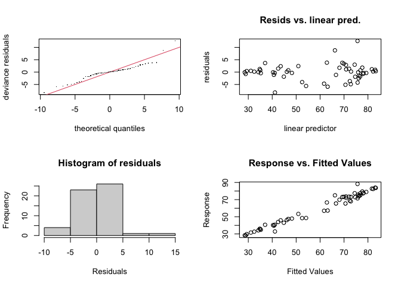<!-- -->

    ## 
    ## Method: ML   Optimizer: outer newton
    ## full convergence after 5 iterations.
    ## Gradient range [-3.915588e-09,-4.827596e-10]
    ## (score 179.4934 & scale 15.99167).
    ## Hessian positive definite, eigenvalue range [1.053414,28.3462].
    ## Model rank =  20 / 20 
    ## 
    ## Basis dimension (k) checking results. Low p-value (k-index<1) may
    ## indicate that k is too low, especially if edf is close to k'.
    ## 
    ##                        k'  edf k-index p-value    
    ## s(date_dec):SiteEast 9.00 6.85    0.63  <2e-16 ***
    ## s(date_dec):SiteWest 9.00 7.88    0.63   0.005 ** 
    ## ---
    ## Signif. codes:  0 '***' 0.001 '**' 0.01 '*' 0.05 '.' 0.1 ' ' 1

``` r
## Compare models
AIC(cover.gam1, cover.gam2) #gam 1 has no interaction, gam 2 has interaction. This shows that including the interaction between date and site improves the model's performance
```

    ##                  df      AIC
    ## cover.gam1 11.36478 341.6348
    ## cover.gam2 19.24328 327.0838

``` r
#overall, we're keeping GAM over LM, with the smoothed term (date) and with the date*site interaction (cover.gam2)
```

##### Plot with Model Data

``` r
x_range <- range(mussel_cover_avg$date_dec)
x_new <- seq(from = x_range[1], to = x_range[2], by = 0.1)
x_new
```

    ##  [1] 2014.414 2014.514 2014.614 2014.714 2014.814 2014.914 2015.014 2015.114
    ##  [9] 2015.214 2015.314 2015.414 2015.514 2015.614 2015.714 2015.814 2015.914
    ## [17] 2016.014 2016.114 2016.214 2016.314 2016.414 2016.514 2016.614 2016.714
    ## [25] 2016.814 2016.914 2017.014 2017.114 2017.214 2017.314 2017.414 2017.514
    ## [33] 2017.614 2017.714 2017.814 2017.914 2018.014 2018.114 2018.214 2018.314
    ## [41] 2018.414 2018.514 2018.614 2018.714 2018.814 2018.914 2019.014 2019.114
    ## [49] 2019.214 2019.314 2019.414 2019.514 2019.614 2019.714 2019.814 2019.914
    ## [57] 2020.014 2020.114 2020.214 2020.314 2020.414 2020.514 2020.614 2020.714
    ## [65] 2020.814 2020.914 2021.014 2021.114 2021.214 2021.314 2021.414 2021.514
    ## [73] 2021.614 2021.714 2021.814 2021.914 2022.014 2022.114 2022.214 2022.314
    ## [81] 2022.414 2022.514 2022.614 2022.714 2022.814 2022.914 2023.014 2023.114
    ## [89] 2023.214 2023.314 2023.414 2023.514 2023.614 2023.714 2023.814 2023.914
    ## [97] 2024.014 2024.114

``` r
site_levels <- unique(mussel_cover_avg$Site)
```

``` r
# Make the prediction dataframe
cover_pred <- expand.grid(x_new, site_levels) %>% 
  as_tibble() %>% 
  rename(date_dec = Var1, Site = Var2)
head(cover_pred)
```

    ## # A tibble: 6 × 2
    ##   date_dec Site 
    ##      <dbl> <fct>
    ## 1    2014. East 
    ## 2    2015. East 
    ## 3    2015. East 
    ## 4    2015. East 
    ## 5    2015. East 
    ## 6    2015. East

``` r
# Predictions given the model
y_pred <- predict(cover.gam2, cover_pred, se.fit = TRUE)
y_pred
```

    ## $fit
    ##        1        2        3        4        5        6        7        8 
    ## 40.35012 40.77009 41.19154 41.61535 42.04150 42.46988 42.89969 43.32719 
    ##        9       10       11       12       13       14       15       16 
    ## 43.74780 44.15624 44.54650 44.91257 45.25048 45.56113 45.84612 46.10707 
    ##       17       18       19       20       21       22       23       24 
    ## 46.34795 46.58267 46.82789 47.10533 47.44173 47.86403 48.39914 49.07048 
    ##       25       26       27       28       29       30       31       32 
    ## 49.89580 50.89233 52.07345 53.43623 54.97289 56.66254 58.47186 60.36706 
    ##       33       34       35       36       37       38       39       40 
    ## 62.31429 64.27588 66.20819 68.06704 69.81001 71.40192 72.81001 74.01261 
    ##       41       42       43       44       45       46       47       48 
    ## 74.99849 75.75689 76.28365 76.59793 76.73357 76.72552 76.60925 76.42258 
    ##       49       50       51       52       53       54       55       56 
    ## 76.20367 75.98511 75.79428 75.65830 75.59828 75.62103 75.73132 75.93387 
    ##       57       58       59       60       61       62       63       64 
    ## 76.23082 76.61344 77.07002 77.58596 78.14375 78.72641 79.31984 79.91068 
    ##       65       66       67       68       69       70       71       72 
    ## 80.48555 81.03109 81.53395 81.98075 82.35845 82.66076 82.88777 83.03983 
    ##       73       74       75       76       77       78       79       80 
    ## 83.11730 83.12052 83.04984 82.90567 82.68892 82.40068 82.04205 81.61414 
    ##       81       82       83       84       85       86       87       88 
    ## 81.11805 80.55489 79.92575 79.23175 78.47397 77.65354 76.77181 75.83125 
    ##       89       90       91       92       93       94       95       96 
    ## 74.83463 73.78470 72.68422 71.53687 70.34882 69.12663 67.87687 66.60611 
    ##       97       98       99      100      101      102      103      104 
    ## 65.32084 64.02679 28.50510 28.99466 29.49078 29.99926 30.52370 31.06749 
    ##      105      106      107      108      109      110      111      112 
    ## 31.63155 32.20642 32.77970 33.33421 33.84822 34.29984 34.67102 34.95283 
    ##      113      114      115      116      117      118      119      120 
    ## 35.13766 35.21791 35.19206 35.08388 34.92442 34.75953 34.65001 34.65729 
    ##      121      122      123      124      125      126      127      128 
    ## 34.84274 35.26247 35.96404 36.99423 38.39171 40.16095 42.29608 44.76212 
    ##      129      130      131      132      133      134      135      136 
    ## 47.49646 50.43539 53.51506 56.66202 59.78775 62.80239 65.61942 68.16603 
    ##      137      138      139      140      141      142      143      144 
    ## 70.37411 72.19840 73.61527 74.60201 75.14957 75.29699 75.11340 74.67016 
    ##      145      146      147      148      149      150      151      152 
    ## 74.03930 73.29574 72.51448 71.75735 71.07372 70.51237 70.10951 69.87143 
    ##      153      154      155      156      157      158      159      160 
    ## 69.80006 69.89733 70.16086 70.57016 71.09996 71.72343 72.41213 73.14027 
    ##      161      162      163      164      165      166      167      168 
    ## 73.89348 74.66038 75.42962 76.18981 76.92959 77.63758 78.30282 78.92278 
    ##      169      170      171      172      173      174      175      176 
    ## 79.50297 80.04917 80.56719 81.06284 81.54192 82.00853 82.45442 82.86596 
    ##      177      178      179      180      181      182      183      184 
    ## 83.22949 83.53134 83.75787 83.89541 83.93029 83.84887 83.63747 83.28245 
    ##      185      186      187      188      189      190      191      192 
    ## 82.77219 82.10360 81.27583 80.28803 79.13934 77.83430 76.39177 74.83300 
    ##      193      194      195      196 
    ## 73.17922 71.45167 69.67151 67.85885 
    ## 
    ## $se.fit
    ##        1        2        3        4        5        6        7        8 
    ## 2.425096 2.098013 1.858859 1.732123 1.715645 1.775161 1.863717 1.945954 
    ##        9       10       11       12       13       14       15       16 
    ## 2.001160 2.024407 2.022184 2.004435 1.983184 1.970527 1.972030 1.984913 
    ##       17       18       19       20       21       22       23       24 
    ## 2.000425 2.010755 2.009593 1.996388 1.976455 1.955529 1.938170 1.928633 
    ##       25       26       27       28       29       30       31       32 
    ## 1.930190 1.940851 1.954500 1.965737 1.969248 1.963372 1.950366 1.932334 
    ##       33       34       35       36       37       38       39       40 
    ## 1.910506 1.887363 1.866928 1.850154 1.835300 1.821296 1.806051 1.789180 
    ##       41       42       43       44       45       46       47       48 
    ## 1.772524 1.757517 1.746788 1.746908 1.763460 1.795480 1.835891 1.876286 
    ##       49       50       51       52       53       54       55       56 
    ## 1.907505 1.924320 1.926795 1.917043 1.900998 1.889672 1.892134 1.912479 
    ##       57       58       59       60       61       62       63       64 
    ## 1.949471 1.998736 2.052410 2.103010 2.145839 2.178835 2.206289 2.234476 
    ##       65       66       67       68       69       70       71       72 
    ## 2.268804 2.312568 2.366267 2.427566 2.491958 2.556084 2.617947 2.674516 
    ##       73       74       75       76       77       78       79       80 
    ## 2.721816 2.755351 2.770746 2.765359 2.743780 2.714120 2.684357 2.661136 
    ##       81       82       83       84       85       86       87       88 
    ## 2.648703 2.648150 2.657148 2.670268 2.679759 2.676589 2.652473 2.604077 
    ##       89       90       91       92       93       94       95       96 
    ## 2.531390 2.437392 2.329164 2.221041 2.137601 2.107692 2.156887 2.298431 
    ##       97       98       99      100      101      102      103      104 
    ## 2.529088 2.833739 2.533396 2.139752 1.871037 1.764446 1.806307 1.932125 
    ##      105      106      107      108      109      110      111      112 
    ## 2.070681 2.177844 2.232430 2.234761 2.200300 2.148783 2.102240 2.080766 
    ##      113      114      115      116      117      118      119      120 
    ## 2.091643 2.126404 2.166267 2.195095 2.200990 2.182803 2.149787 2.112768 
    ##      121      122      123      124      125      126      127      128 
    ## 2.081414 2.064725 2.068828 2.090174 2.117689 2.141054 2.150820 2.144342 
    ##      129      130      131      132      133      134      135      136 
    ## 2.126203 2.101818 2.076137 2.056154 2.049959 2.059021 2.078506 2.102426 
    ##      137      138      139      140      141      142      143      144 
    ## 2.122345 2.132578 2.131615 2.118603 2.096324 2.076225 2.070755 2.083765 
    ##      145      146      147      148      149      150      151      152 
    ## 2.109487 2.138237 2.157348 2.158318 2.139762 2.103435 2.057280 2.018032 
    ##      153      154      155      156      157      158      159      160 
    ## 2.000870 2.013882 2.056283 2.120934 2.194429 2.263521 2.319240 2.356954 
    ##      161      162      163      164      165      166      167      168 
    ## 2.382033 2.403539 2.430089 2.467923 2.519618 2.583689 2.655287 2.730466 
    ##      169      170      171      172      173      174      175      176 
    ## 2.806372 2.878156 2.939287 2.982310 2.999845 2.986979 2.949430 2.898549 
    ##      177      178      179      180      181      182      183      184 
    ## 2.846215 2.803117 2.777014 2.771241 2.783932 2.808273 2.833661 2.847319 
    ##      185      186      187      188      189      190      191      192 
    ## 2.837067 2.796619 2.723577 2.618881 2.488112 2.345874 2.221068 2.151038 
    ##      193      194      195      196 
    ## 2.172935 2.309527 2.559559 2.903067

``` r
# 95% CI assuming normal distribution
upr <- y_pred$fit + (2 * y_pred$se.fit) 
lwr <- y_pred$fit - (2 * y_pred$se.fit)

cover_pred <- cover_pred %>%
  mutate(PCover = y_pred$fit, 
         upper = upr, 
         lower = lwr)
```

###### Fig2A - Mussel Cover Model Data

``` r
## Final plot with model output
Fig2A <- mussel_cover_avg %>% 
  ggplot(aes(date_dec, PCover, color = Site, fill = Site)) + 
  geom_ribbon(data = cover_pred, aes(ymin = lower, ymax = upper, 
                                 fill = Site, color = NULL), alpha = 0.5) + 
  geom_line(data = cover_pred, size =0.75) + 
  geom_point(size = 5, alpha = 0.7, pch = 21, color = "black") +
  theme_minimal() + 
  theme(panel.background = element_blank(), 
        axis.line = element_line (colour = "black"), 
        axis.text.y = element_text(size = 25),
        axis.text.x = element_text(angle = 0, hjust = 0.5, size=25),
        axis.title.y = element_text(size = 25),
        axis.title.x = element_text(size = 25),
        legend.position = "none") +
  scale_y_continuous(limits = c(10, 100)) + 
  labs(x = "Date", y = "Mussel Percent Cover") +
  scale_color_manual(values=group.colors) +
  scale_fill_manual(values=group.colors) 
```

    ## Warning: Using `size` aesthetic for lines was deprecated in ggplot2 3.4.0.
    ## ℹ Please use `linewidth` instead.
    ## This warning is displayed once every 8 hours.
    ## Call `lifecycle::last_lifecycle_warnings()` to see where this warning was
    ## generated.

``` r
Fig2A
```

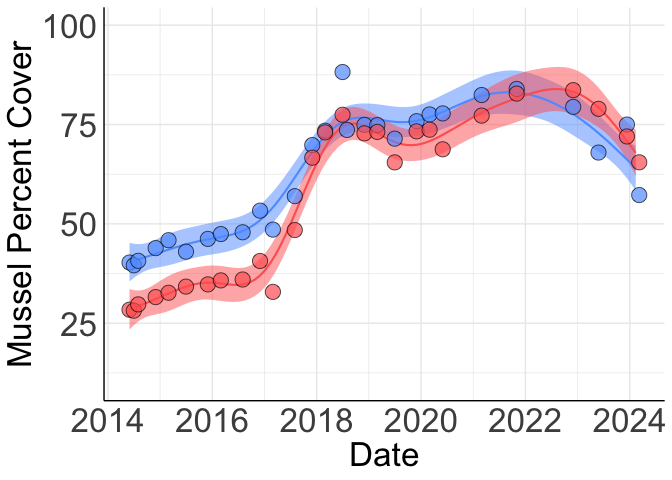<!-- -->

``` r
#ggsave(here("Figures", "Fig2A.png", height=3, width=3, scale=3))
```

#### Mussel Bed Height

Converting date to decimal date

``` r
mussel_height_avg <- mussel_height_avg %>% mutate(date_dec = decimal_date(Date))
mussel_height_avg
```

    ## # A tibble: 55 × 5
    ## # Groups:   Date [28]
    ##    Date       Site  Avg.Height na.rm date_dec
    ##    <date>     <fct>      <dbl> <lgl>    <dbl>
    ##  1 2014-06-01 East        41.2 TRUE     2014.
    ##  2 2014-06-01 West        53.1 TRUE     2014.
    ##  3 2014-07-01 East        38.0 TRUE     2014.
    ##  4 2014-07-01 West        52.9 TRUE     2014.
    ##  5 2014-08-01 East        39.2 TRUE     2015.
    ##  6 2014-08-01 West        53.1 TRUE     2015.
    ##  7 2014-12-01 East        36.3 TRUE     2015.
    ##  8 2014-12-01 West        52.9 TRUE     2015.
    ##  9 2015-03-01 East        31.6 TRUE     2015.
    ## 10 2015-03-01 West        53.0 TRUE     2015.
    ## # ℹ 45 more rows

GAMS Reference
<http://r.qcbs.ca/workshop08/book-en/introduction-to-gams.html>

Most of the code from here on was written by Robin Elahi

``` r
#practice with one subset of the data first
mussel_height_avg_sub <- mussel_height_avg %>% filter(Site == "West")
```

``` r
## Linear
height.gam1 <- gam(Avg.Height ~ date_dec, data = mussel_height_avg_sub)
summary(height.gam1)
```

    ## 
    ## Family: gaussian 
    ## Link function: identity 
    ## 
    ## Formula:
    ## Avg.Height ~ date_dec
    ## 
    ## Parametric coefficients:
    ##               Estimate Std. Error t value Pr(>|t|)    
    ## (Intercept) 10178.7304   933.4247   10.90 5.43e-11 ***
    ## date_dec       -5.0266     0.4624  -10.87 5.80e-11 ***
    ## ---
    ## Signif. codes:  0 '***' 0.001 '**' 0.01 '*' 0.05 '.' 0.1 ' ' 1
    ## 
    ## 
    ## R-sq.(adj) =  0.818   Deviance explained = 82.5%
    ## GCV = 54.548  Scale est. = 50.508    n = 27

``` r
par(mfrow = c(2, 2))
gam.check(height.gam1) # residuals exhibit curvilinear trend
```

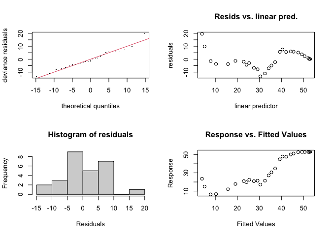<!-- -->

    ## 
    ## Method: GCV   Optimizer: magic
    ## Model required no smoothing parameter selectionModel rank =  2 / 2

``` r
fitted(height.gam1)
```

    ##  [1] 53.050451 52.637305 52.210387 50.530258 49.290819 47.610691 45.503644
    ##  [8] 44.252691 42.151402 40.475864 39.237591 37.130545 35.450416 34.210977
    ## [15] 32.530849 30.423802 29.184363 27.504235 25.397188 24.146235 22.882715
    ## [22] 19.131135 15.757107 10.317347  7.879783  5.139246  3.957376

``` r
acf(residuals(height.gam1)) 
```

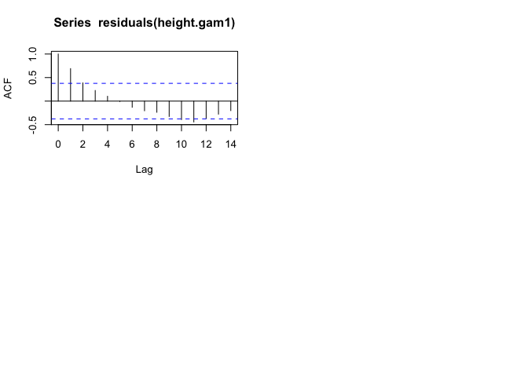<!-- -->

``` r
## Wiggly
height.gam2 <- gam(Avg.Height ~ s(date_dec), data = mussel_height_avg_sub) #the s() function makes it a smoothed (non-linear) term
summary(height.gam2) #R squared increased a lot
```

    ## 
    ## Family: gaussian 
    ## Link function: identity 
    ## 
    ## Formula:
    ## Avg.Height ~ s(date_dec)
    ## 
    ## Parametric coefficients:
    ##             Estimate Std. Error t value Pr(>|t|)    
    ## (Intercept)  32.5183     0.2811   115.7   <2e-16 ***
    ## ---
    ## Signif. codes:  0 '***' 0.001 '**' 0.01 '*' 0.05 '.' 0.1 ' ' 1
    ## 
    ## Approximate significance of smooth terms:
    ##               edf Ref.df     F p-value    
    ## s(date_dec) 8.547  8.939 376.5  <2e-16 ***
    ## ---
    ## Signif. codes:  0 '***' 0.001 '**' 0.01 '*' 0.05 '.' 0.1 ' ' 1
    ## 
    ## R-sq.(adj) =  0.992   Deviance explained = 99.5%
    ## GCV = 3.2994  Scale est. = 2.1327    n = 27

``` r
plot(height.gam2) # "The mgcv package also includes a default plot() function to look at the smooths"
```

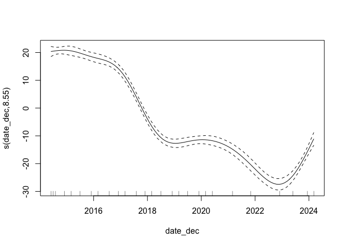<!-- -->

``` r
acf(residuals(height.gam2)) 
```

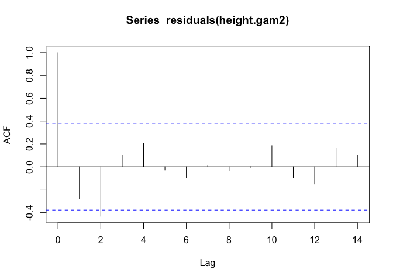<!-- -->

``` r
par(mfrow = c(2,2))
gam.check(height.gam2)
```

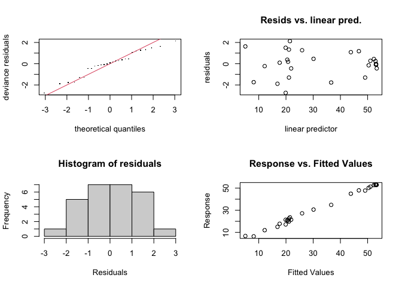<!-- -->

    ## 
    ## Method: GCV   Optimizer: magic
    ## Smoothing parameter selection converged after 9 iterations.
    ## The RMS GCV score gradient at convergence was 4.313581e-06 .
    ## The Hessian was positive definite.
    ## Model rank =  10 / 10 
    ## 
    ## Basis dimension (k) checking results. Low p-value (k-index<1) may
    ## indicate that k is too low, especially if edf is close to k'.
    ## 
    ##               k'  edf k-index p-value
    ## s(date_dec) 9.00 8.55    1.27    0.89

``` r
k.check(height.gam2)
```

    ##             k'      edf  k-index p-value
    ## s(date_dec)  9 8.547393 1.266241  0.8825

``` r
## Compare models - "Generally, the smaller the AIC, the “better” is the predictive performance of the model."
# Here we ask whether adding a smooth function to the linear model improves the fit of the model to our dataset.

AIC(height.gam1, height.gam2) # lower AIC = better performing model --> gam2 (with smoothed term) is better
```

    ##                   df      AIC
    ## height.gam1  3.00000 186.4420
    ## height.gam2 10.54739 106.3857

``` r
#"Here, the AIC of the smooth GAM is lower, which indicates that adding a smoothing function improves model performance. Linearity is therefore not supported by our data."
```

``` r
#"when we compare the fit of the linear (red) and non-linear (blue) models, it is clear that the blue one is more appropriate for our dataset"
mussel_height_avg_sub %>% 
  ggplot(aes(date_dec, Avg.Height)) + 
  geom_point(size = 3, alpha = 0.5) + 
  geom_line(aes(y = fitted(height.gam1)), color = "red") + 
  geom_line(aes(y = fitted(height.gam2)), color = "blue")
```

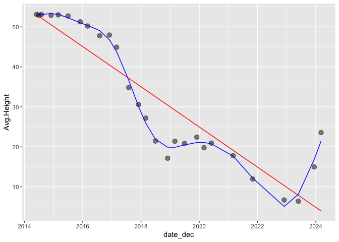<!-- -->

Now for real with all the data

``` r
mussel_height_avg <- mussel_height_avg %>% mutate(Site = as.factor(Site))
mussel_height_avg
```

    ## # A tibble: 55 × 5
    ## # Groups:   Date [28]
    ##    Date       Site  Avg.Height na.rm date_dec
    ##    <date>     <fct>      <dbl> <lgl>    <dbl>
    ##  1 2014-06-01 East        41.2 TRUE     2014.
    ##  2 2014-06-01 West        53.1 TRUE     2014.
    ##  3 2014-07-01 East        38.0 TRUE     2014.
    ##  4 2014-07-01 West        52.9 TRUE     2014.
    ##  5 2014-08-01 East        39.2 TRUE     2015.
    ##  6 2014-08-01 West        53.1 TRUE     2015.
    ##  7 2014-12-01 East        36.3 TRUE     2015.
    ##  8 2014-12-01 West        52.9 TRUE     2015.
    ##  9 2015-03-01 East        31.6 TRUE     2015.
    ## 10 2015-03-01 West        53.0 TRUE     2015.
    ## # ℹ 45 more rows

``` r
## Trying with no interaction between date and site
height.gam1 <- gam(Avg.Height ~ s(date_dec) + Site, data = mussel_height_avg, method = "ML")
gam1_summary <- summary(height.gam1)
gam1_summary$p.table
```

    ##             Estimate Std. Error   t value     Pr(>|t|)
    ## (Intercept) 18.41340  0.9953994 18.498501 1.323982e-23
    ## SiteWest    13.98502  1.4210354  9.841427 3.845139e-13

``` r
gam1_summary$s.table
```

    ##                  edf   Ref.df        F p-value
    ## s(date_dec) 4.538598 5.559846 58.68405       0

``` r
par(mfrow = c(1, 2))
plot(height.gam1, all.terms = TRUE)
```

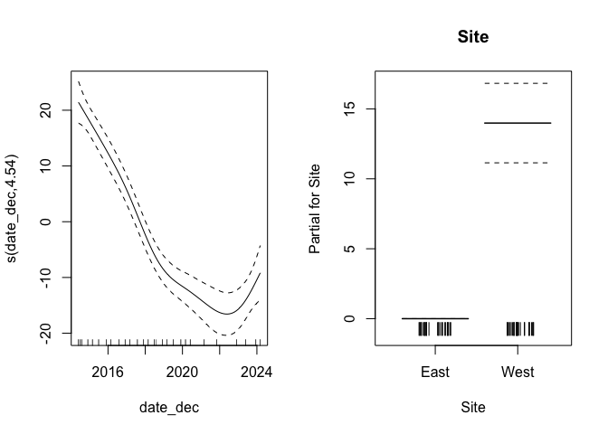<!-- -->

``` r
acf(residuals(height.gam1)) 
```

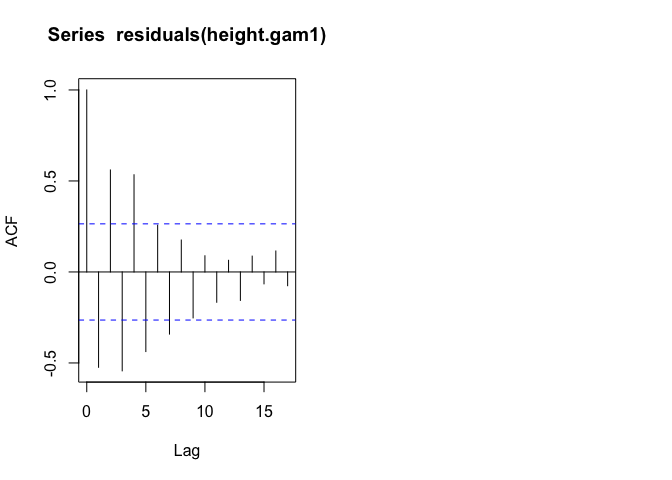<!-- -->

``` r
# USING THIS MODEL (see AIC below)
## With interaction between date and site
# https://r.qcbs.ca/workshop08/book-en/gam-with-interaction-terms.html

height.gam2 <- gam(Avg.Height ~ s(date_dec, by = Site) + Site, data = mussel_height_avg, method = "ML") # this is default, thin plate regression spline
gam2_summary <- summary(height.gam2)
gam2_summary$p.table
```

    ##             Estimate Std. Error  t value     Pr(>|t|)
    ## (Intercept) 18.40685  0.4882650 37.69849 1.604154e-32
    ## SiteWest    13.91531  0.6970225 19.96393 3.315080e-22

``` r
gam2_summary$s.table
```

    ##                           edf   Ref.df         F p-value
    ## s(date_dec):SiteEast 5.939681 7.092141  65.21351       0
    ## s(date_dec):SiteWest 7.674166 8.544871 125.29349       0

``` r
par(mfrow = c(2, 2))
plot(height.gam2, all.terms = TRUE) # the first two plots show the interaction effect of the date smooth and each level of the Site factor variable.
acf(residuals(height.gam2)) 
```

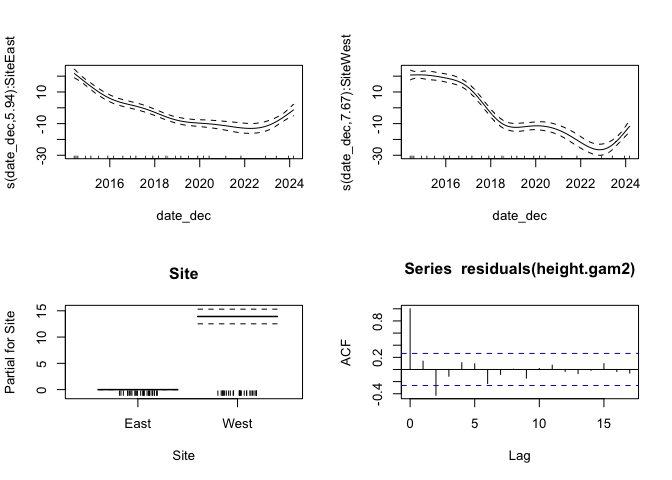<!-- -->

``` r
## Check gam
par(mfrow = c(2, 2))
gam.check(height.gam2)
```

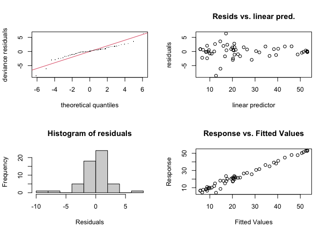<!-- -->

    ## 
    ## Method: ML   Optimizer: outer newton
    ## full convergence after 5 iterations.
    ## Gradient range [-9.5638e-08,2.817501e-08]
    ## (score 152.3635 & scale 6.667029).
    ## Hessian positive definite, eigenvalue range [0.8964337,28.24145].
    ## Model rank =  20 / 20 
    ## 
    ## Basis dimension (k) checking results. Low p-value (k-index<1) may
    ## indicate that k is too low, especially if edf is close to k'.
    ## 
    ##                        k'  edf k-index p-value  
    ## s(date_dec):SiteEast 9.00 5.94    0.86    0.10 .
    ## s(date_dec):SiteWest 9.00 7.67    0.86    0.06 .
    ## ---
    ## Signif. codes:  0 '***' 0.001 '**' 0.01 '*' 0.05 '.' 0.1 ' ' 1

``` r
## Compare models
AIC(height.gam1, height.gam2) #gam 1 has no interaction, gam 2 has interaction. This shows that including the interaction between date and site improves the model's performance
```

    ##                    df      AIC
    ## height.gam1  8.559846 348.9794
    ## height.gam2 18.140920 278.3441

``` r
#overall, we're keeping GAM over LM, with the smoothed term (date) and with the date*site interaction (height.gam2)
```

##### Plot with Model Data

``` r
height.x_range <- range(mussel_height_avg$date_dec)
height.x_new <- seq(from = height.x_range[1], to = height.x_range[2], by = 0.1)
height.x_new
```

    ##  [1] 2014.414 2014.514 2014.614 2014.714 2014.814 2014.914 2015.014 2015.114
    ##  [9] 2015.214 2015.314 2015.414 2015.514 2015.614 2015.714 2015.814 2015.914
    ## [17] 2016.014 2016.114 2016.214 2016.314 2016.414 2016.514 2016.614 2016.714
    ## [25] 2016.814 2016.914 2017.014 2017.114 2017.214 2017.314 2017.414 2017.514
    ## [33] 2017.614 2017.714 2017.814 2017.914 2018.014 2018.114 2018.214 2018.314
    ## [41] 2018.414 2018.514 2018.614 2018.714 2018.814 2018.914 2019.014 2019.114
    ## [49] 2019.214 2019.314 2019.414 2019.514 2019.614 2019.714 2019.814 2019.914
    ## [57] 2020.014 2020.114 2020.214 2020.314 2020.414 2020.514 2020.614 2020.714
    ## [65] 2020.814 2020.914 2021.014 2021.114 2021.214 2021.314 2021.414 2021.514
    ## [73] 2021.614 2021.714 2021.814 2021.914 2022.014 2022.114 2022.214 2022.314
    ## [81] 2022.414 2022.514 2022.614 2022.714 2022.814 2022.914 2023.014 2023.114
    ## [89] 2023.214 2023.314 2023.414 2023.514 2023.614 2023.714 2023.814 2023.914
    ## [97] 2024.014 2024.114

``` r
height.site_levels <- unique(mussel_height_avg$Site)
```

``` r
# Make the prediction dataframe
height_pred <- expand.grid(height.x_new, height.site_levels) %>% 
  as_tibble() %>% 
  rename(date_dec = Var1, Site = Var2)
head(height_pred)
```

    ## # A tibble: 6 × 2
    ##   date_dec Site 
    ##      <dbl> <fct>
    ## 1    2014. East 
    ## 2    2015. East 
    ## 3    2015. East 
    ## 4    2015. East 
    ## 5    2015. East 
    ## 6    2015. East

``` r
# Predictions given the model
height.y_pred <- predict(height.gam2, height_pred, se.fit = TRUE)
height.y_pred
```

    ## $fit
    ##         1         2         3         4         5         6         7         8 
    ## 40.223826 39.092867 37.962795 36.835601 35.714131 34.601297 33.500344 32.415895 
    ##         9        10        11        12        13        14        15        16 
    ## 31.352963 30.317160 29.314672 28.351703 27.433978 26.566088 25.752458 24.997513 
    ##        17        18        19        20        21        22        23        24 
    ## 24.304785 23.674072 23.104081 22.590661 22.126782 21.705291 21.319022 20.959908 
    ##        25        26        27        28        29        30        31        32 
    ## 20.618436 20.284957 19.950163 19.606174 19.245601 18.863490 18.457200 18.024176 
    ##        33        34        35        36        37        38        39        40 
    ## 17.561903 17.070142 16.552225 16.011796 15.453107 14.882944 14.308774 13.738549 
    ##        41        42        43        44        45        46        47        48 
    ## 13.180677 12.643583 12.135013 11.660024 11.221695 10.822947 10.466095 10.150904 
    ##        49        50        51        52        53        54        55        56 
    ##  9.876404  9.640084  9.437974  9.266043  9.119904  8.994310  8.883894  8.783286 
    ##        57        58        59        60        61        62        63        64 
    ##  8.687272  8.591274  8.490928  8.382846  8.264634  8.134408  7.992258  7.838792 
    ##        65        66        67        68        69        70        71        72 
    ##  7.674619  7.500345  7.316579  7.123928  6.923095  6.716768  6.509513  6.305971 
    ##        73        74        75        76        77        78        79        80 
    ##  6.110784  5.928594  5.764041  5.621845  5.507281  5.425869  5.383130  5.384584 
    ##        81        82        83        84        85        86        87        88 
    ##  5.435752  5.542156  5.709315  5.942750  6.247983  6.630533  7.094583  7.638734 
    ##        89        90        91        92        93        94        95        96 
    ##  8.260133  8.955928  9.723263 10.557669 11.450368 12.391871 13.372690 14.383337 
    ##        97        98        99       100       101       102       103       104 
    ## 15.414435 16.457840 53.045734 53.085566 53.120448 53.143984 53.149528 53.130428 
    ##       105       106       107       108       109       110       111       112 
    ## 53.080952 52.999193 52.884360 52.738146 52.564598 52.367854 52.151493 51.917770 
    ##       113       114       115       116       117       118       119       120 
    ## 51.668746 51.406481 51.131363 50.836795 50.514176 50.150564 49.728647 49.230925 
    ##       121       122       123       124       125       126       127       128 
    ## 48.639918 47.939790 47.117354 46.159666 45.056393 43.808144 42.418863 40.902144 
    ##       129       130       131       132       133       134       135       136 
    ## 39.280726 37.577709 35.816253 34.023314 32.231797 30.475130 28.786021 27.194178 
    ##       137       138       139       140       141       142       143       144 
    ## 25.728210 24.410039 23.255250 22.279163 21.492423 20.888956 20.451918 20.163664 
    ##       145       146       147       148       149       150       151       152 
    ## 20.005595 19.955126 19.988700 20.084076 20.220255 20.376299 20.533790 20.680292 
    ##       153       154       155       156       157       158       159       160 
    ## 20.804235 20.894051 20.939304 20.934276 20.874544 20.757270 20.581202 20.345322 
    ##       161       162       163       164       165       166       167       168 
    ## 20.049269 19.692862 19.275917 18.798251 18.259680 17.660020 16.999280 16.281452 
    ##       169       170       171       172       173       174       175       176 
    ## 15.514310 14.705776 13.863770 12.996216 12.111034 11.217135 10.330540  9.470389 
    ##       177       178       179       180       181       182       183       184 
    ##  8.655831  7.906019  7.240103  6.677234  6.236563  5.937243  5.798423  5.839254 
    ##       185       186       187       188       189       190       191       192 
    ##  6.075341  6.507499  7.132693  7.947888  8.950038 10.130792 11.467638 12.935726 
    ##       193       194       195       196 
    ## 14.510207 16.166232 17.879169 19.626757 
    ## 
    ## $se.fit
    ##        1        2        3        4        5        6        7        8 
    ## 1.502391 1.326010 1.189831 1.104138 1.070088 1.076629 1.105321 1.139673 
    ##        9       10       11       12       13       14       15       16 
    ## 1.168209 1.186288 1.194650 1.195899 1.193865 1.192914 1.195195 1.199942 
    ##       17       18       19       20       21       22       23       24 
    ## 1.204319 1.205985 1.203039 1.195681 1.186249 1.176999 1.169489 1.165071 
    ##       25       26       27       28       29       30       31       32 
    ## 1.164815 1.167768 1.171445 1.173829 1.172937 1.168269 1.160883 1.151650 
    ##       33       34       35       36       37       38       39       40 
    ## 1.140958 1.129678 1.119386 1.110434 1.102156 1.094345 1.086403 1.078416 
    ##       41       42       43       44       45       46       47       48 
    ## 1.071266 1.065457 1.061790 1.062628 1.070028 1.083536 1.100391 1.117465 
    ##       49       50       51       52       53       54       55       56 
    ## 1.131306 1.140061 1.144015 1.144162 1.142899 1.144498 1.152203 1.167143 
    ##       57       58       59       60       61       62       63       64 
    ## 1.188408 1.214148 1.241292 1.267080 1.289960 1.309413 1.327500 1.346951 
    ##       65       66       67       68       69       70       71       72 
    ## 1.369945 1.397613 1.429801 1.465112 1.501228 1.536475 1.569946 1.600356 
    ##       73       74       75       76       77       78       79       80 
    ## 1.626052 1.645179 1.655933 1.657260 1.651211 1.641247 1.630626 1.621913 
    ##       81       82       83       84       85       86       87       88 
    ## 1.616600 1.614856 1.615482 1.616058 1.613261 1.603300 1.582880 1.551290 
    ##       89       90       91       92       93       94       95       96 
    ## 1.509597 1.460503 1.408860 1.362912 1.335061 1.338420 1.383299 1.474082 
    ##       97       98       99      100      101      102      103      104 
    ## 1.608440 1.779427 1.622310 1.376759 1.206811 1.134729 1.153605 1.226150 
    ##      105      106      107      108      109      110      111      112 
    ## 1.309480 1.376029 1.412044 1.416964 1.399511 1.371029 1.344294 1.331158 
    ##      113      114      115      116      117      118      119      120 
    ## 1.336178 1.354873 1.376699 1.392484 1.395340 1.384575 1.365552 1.344458 
    ##      121      122      123      124      125      126      127      128 
    ## 1.326689 1.317254 1.319622 1.331715 1.347158 1.360118 1.365225 1.361070 
    ##      129      130      131      132      133      134      135      136 
    ## 1.350437 1.336483 1.321964 1.310781 1.307507 1.312873 1.324016 1.337570 
    ##      137      138      139      140      141      142      143      144 
    ## 1.348768 1.354464 1.353916 1.346650 1.334213 1.323184 1.320676 1.328720 
    ##      145      146      147      148      149      150      151      152 
    ## 1.343783 1.360205 1.370652 1.370316 1.358636 1.336879 1.309915 1.287702 
    ##      153      154      155      156      157      158      159      160 
    ## 1.279075 1.288523 1.315287 1.355009 1.399747 1.441749 1.475850 1.499464 
    ##      161      162      163      164      165      166      167      168 
    ## 1.515964 1.530856 1.549280 1.574843 1.608877 1.650241 1.695783 1.742987 
    ##      169      170      171      172      173      174      175      176 
    ## 1.790111 1.834284 1.871659 1.897859 1.908568 1.900971 1.878661 1.848580 
    ##      177      178      179      180      181      182      183      184 
    ## 1.817905 1.792993 1.778351 1.775773 1.783925 1.798533 1.813085 1.819795 
    ##      185      186      187      188      189      190      191      192 
    ## 1.811291 1.783899 1.736392 1.669657 1.587527 1.499465 1.423689 1.383347 
    ##      193      194      195      196 
    ## 1.401001 1.490080 1.649439 1.866763

``` r
# 95% CI assuming normal distribution
height.upr <- height.y_pred$fit + (2 * height.y_pred$se.fit) 
height.lwr <- height.y_pred$fit - (2 * height.y_pred$se.fit)

height_pred <- height_pred %>%
  mutate(Avg.Height = height.y_pred$fit, 
         upper = height.upr, 
         lower = height.lwr)
```

###### Fig2B - Mussel Bed Height Model Data

``` r
## Final plot with model output
Fig2B <- mussel_height_avg %>% 
  ggplot(aes(date_dec, Avg.Height, color = Site, fill = Site)) + 
  geom_ribbon(data = height_pred, aes(ymin = height.lwr, ymax = height.upr, 
                                 fill = Site, color = NULL), alpha = 0.5) + 
  geom_line(data = height_pred) + 
  geom_point(size = 5, alpha = 0.7, pch = 21, color = "black") +
  theme_minimal() + 
  theme(panel.background = element_blank(), 
        axis.line = element_line (colour = "black"), 
        axis.text.x = element_text(angle = 0, hjust = 0.5),
        axis.text = element_text(size = 25),
        axis.title = element_text(size = 25),
        legend.position="none") +
  labs(x = "Date", y = "Mussel Bed Height (cm)") +  
  scale_color_manual(values=group.colors) +
  scale_fill_manual(values=group.colors)

Fig2B
```

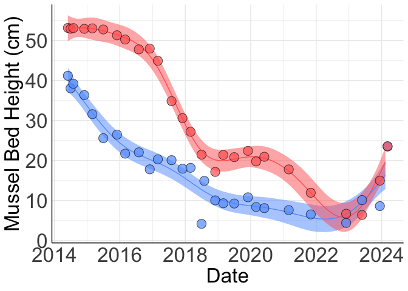<!-- -->

``` r
#ggsave(here("Figures", "Fig2B.png", height=3, width=3, scale=3))
```

## Creating new csv files

For predator models

``` r
mussel_cover_yearly_avg <- mussels %>% group_by(Year, Site) %>% summarize(PCover = mean(PCover))
```

    ## `summarise()` has grouped output by 'Year'. You can override using the
    ## `.groups` argument.

``` r
mussel_height_yearly_avg <- mussels_B %>% group_by(Year, Site) %>% summarize(Avg.Height = mean(Avg.Height))
```

    ## `summarise()` has grouped output by 'Year'. You can override using the
    ## `.groups` argument.

``` r
#write.csv(mussel_cover_yearly_avg, file = here("Data", "Data for Models", "mussel_cover_yearly_avg.csv"), row.names = FALSE)  #to use in models script
#write.csv(mussel_height_yearly_avg, file = here("Data", "Data for Models", "mussel_height_yearly_avg.csv"), row.names= FALSE) #to use in models script
```

For abiotic models

``` r
#write.csv(mussels, file = here("Data", "Data for Models", "mussels.csv"), row.names = FALSE)  #to use in models script
#write.csv(mussels_B, file = here("Data", "Data for Models", "mussels_B.csv"), row.names = FALSE)  #to use in models script
```
