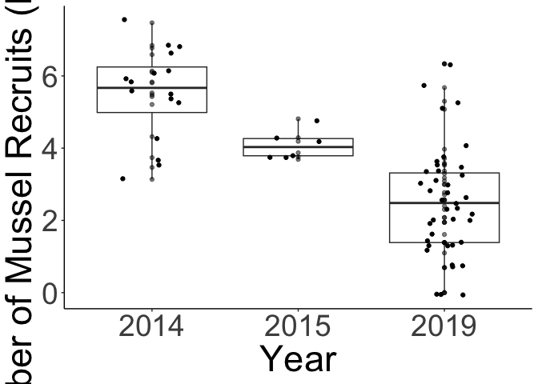
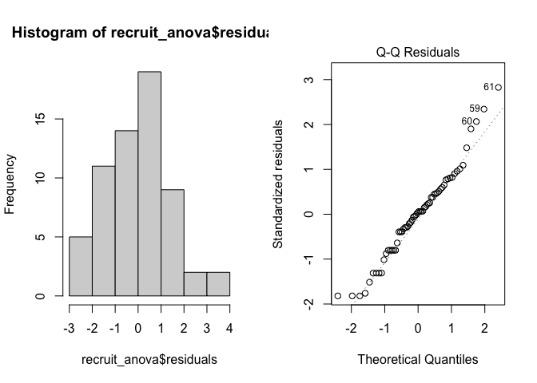
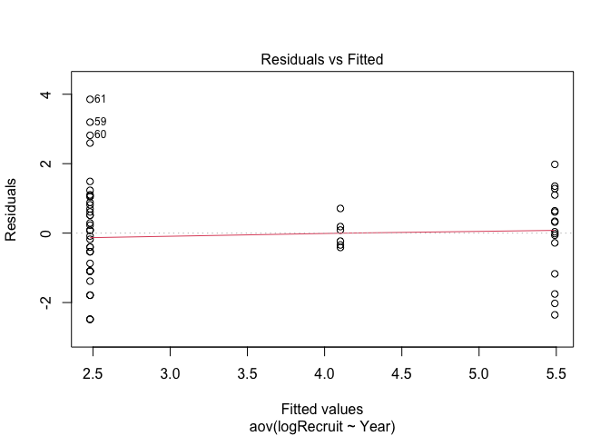
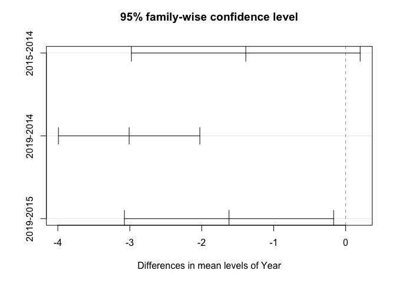

Mussel_Recruitment
================
Micaela Chapuis
2024-07-10

``` r
library(here)
```

    ## here() starts at /Users/micachapuis/GitHub/Chapuis_etal_SeastarMusselProject

``` r
library(tidyverse)
```

    ## ── Attaching core tidyverse packages ──────────────────────── tidyverse 2.0.0 ──
    ## ✔ dplyr     1.1.4     ✔ readr     2.1.5
    ## ✔ forcats   1.0.0     ✔ stringr   1.5.1
    ## ✔ ggplot2   3.5.1     ✔ tibble    3.2.1
    ## ✔ lubridate 1.9.4     ✔ tidyr     1.3.1
    ## ✔ purrr     1.0.2

    ## ── Conflicts ────────────────────────────────────────── tidyverse_conflicts() ──
    ## ✖ dplyr::filter() masks stats::filter()
    ## ✖ dplyr::lag()    masks stats::lag()
    ## ℹ Use the conflicted package (<http://conflicted.r-lib.org/>) to force all conflicts to become errors

``` r
library(lubridate)
library(broom) # for tidy tables
```

## Mussel Recruitment

Load in Recruitment data

``` r
recruitment <- read.csv(here("Data", "mussel_recruitment_data.csv"))
```

Get rid of extra columns

``` r
recruitment <- recruitment %>% select(Date.Collected, Tuffy, Plot, Site, X..of.Mussels)
```

Changing column names

``` r
names(recruitment)[1] <- "Date"
names(recruitment)[3] <- "WholePlot"
names(recruitment)[5] <- "Num.Recruits"
```

Turning Date into Date format (month-day-year)

``` r
recruitment$Date <- as.Date(recruitment$Date, "%m/%d/%y")
```

Making Year column + making it into a factor

``` r
recruitment[,"Year"] <- NA
recruitment$Year <- as.factor(format(recruitment$Date, "%Y"))
```

Add in Month column

``` r
recruitment[, "Month"] <- NA
recruitment$Month <- as.factor(format(recruitment$Date, "%m"))
```

Changing Tuffy (tuffy number), WholePlot and Site to factors

``` r
recruitment$Tuffy <- as.factor(recruitment$Tuffy)
recruitment$WholePlot <- as.factor(recruitment$WholePlot)
recruitment$Site <- as.factor(recruitment$Site)
```

#### Fig 4 - Mussel Recruits by Year

Log transforming data (+1 because we have some 0s and their log would be
infinity)

``` r
recruitment[, "log_recruits"] <- NA
recruitment$log_recruits <- log(recruitment$Num.Recruits + 1)
```

``` r
Fig4 <- recruitment %>% group_by(Year) %>% 
  ggplot(aes(x = Year, y = log_recruits)) + 
  geom_boxplot() +
  theme(panel.background = element_blank(),     
        axis.line = element_line(colour = "black"),
        axis.text = element_text(size=28), 
        axis.title = element_text(size=34)) +
  labs(x = "Year", y ="Number of Mussel Recruits (log (x+1))") + 
  geom_point(alpha=0.5) + geom_jitter(width=0.2, height =0.1)

Fig4
```

    ## Warning: Removed 2 rows containing non-finite outside the scale range
    ## (`stat_boxplot()`).

    ## Warning: Removed 2 rows containing missing values or values outside the scale range
    ## (`geom_point()`).
    ## Removed 2 rows containing missing values or values outside the scale range
    ## (`geom_point()`).

<!-- -->

``` r
#ggsave(here("Figures", "Fig4.png", height=2, width=3,scale = 3))
```

#### Recruitment ANOVA

Filtering out NAs from tuffies that weren’t counted Also log
transforming because some tuffies are on totally different scales (1 vs
1700). Have to add a constant (+1) because there are some 0s and log 0
is -Inf

``` r
recruit_log <- recruitment %>% filter(!is.na(Num.Recruits)) %>% mutate(logRecruit = log(Num.Recruits+1))
```

Following: <https://ourcodingclub.github.io/tutorials/anova/>

For supplementary tidy table:
<https://broom.tidymodels.org/reference/tidy.anova.html>

``` r
recruit_anova <- aov(logRecruit ~ Year, data = recruit_log)
summary(recruit_anova)
```

    ##             Df Sum Sq Mean Sq F value   Pr(>F)    
    ## Year         2  106.6   53.31   27.95 2.88e-09 ***
    ## Residuals   59  112.5    1.91                     
    ## ---
    ## Signif. codes:  0 '***' 0.001 '**' 0.01 '*' 0.05 '.' 0.1 ' ' 1

``` r
tidy(recruit_anova)
```

    ## # A tibble: 2 × 6
    ##   term         df sumsq meansq statistic  p.value
    ##   <chr>     <dbl> <dbl>  <dbl>     <dbl>    <dbl>
    ## 1 Year          2  107.  53.3       28.0  2.88e-9
    ## 2 Residuals    59  113.   1.91      NA   NA

``` r
#checking normality
par(mfrow = c(1,2)) # puts two plots side by side in the same window
hist(recruit_anova$residuals) # residuals histogram
plot(recruit_anova, which = 2) # Q-Q plot
```

<!-- -->

``` r
# Histogram of residuals should follow a normal (gaussian) distribution, and the points in the Q-Q plot should lie mostly on the straight line
```

``` r
#checking homoskedasticity (homogeneity of variances) w/ residuals vs fitted values plot
plot(recruit_anova, which = 1)
```

<!-- -->

``` r
# We want to see a straight red line centered around zero! This means residuals do NOT systematically differ across different groups. --> looks pretty good
```

#### Recruitment lm

Because ANOVA is a linear model, we can run the same code but using the
lm function to get some more details

``` r
recruit_lm <- lm(logRecruit ~ Year, data = recruit_log)
summary(recruit_lm)
```

    ## 
    ## Call:
    ## lm(formula = logRecruit ~ Year, data = recruit_log)
    ## 
    ## Residuals:
    ##     Min      1Q  Median      3Q     Max 
    ## -2.4812 -1.0392  0.0614  0.7066  3.8538 
    ## 
    ## Coefficients:
    ##             Estimate Std. Error t value Pr(>|t|)    
    ## (Intercept)   5.4904     0.3453  15.902  < 2e-16 ***
    ## Year2015     -1.3881     0.6611  -2.100     0.04 *  
    ## Year2019     -3.0092     0.4085  -7.366 6.49e-10 ***
    ## ---
    ## Signif. codes:  0 '***' 0.001 '**' 0.01 '*' 0.05 '.' 0.1 ' ' 1
    ## 
    ## Residual standard error: 1.381 on 59 degrees of freedom
    ## Multiple R-squared:  0.4865, Adjusted R-squared:  0.4691 
    ## F-statistic: 27.95 on 2 and 59 DF,  p-value: 2.885e-09

#### TukeyHSD

To assess the significance of differences between pairs of years

``` r
recruit_tukey <- TukeyHSD(recruit_anova, conf.level = .95)
recruit_tukey
```

    ##   Tukey multiple comparisons of means
    ##     95% family-wise confidence level
    ## 
    ## Fit: aov(formula = logRecruit ~ Year, data = recruit_log)
    ## 
    ## $Year
    ##                diff       lwr        upr     p adj
    ## 2015-2014 -1.388136 -2.977637  0.2013657 0.0985948
    ## 2019-2014 -3.009158 -3.991334 -2.0269823 0.0000000
    ## 2019-2015 -1.621022 -3.074668 -0.1673772 0.0253687

``` r
plot(recruit_tukey)
```

<!-- -->

``` r
tidy(recruit_tukey)
```

    ## # A tibble: 3 × 7
    ##   term  contrast  null.value estimate conf.low conf.high   adj.p.value
    ##   <chr> <chr>          <dbl>    <dbl>    <dbl>     <dbl>         <dbl>
    ## 1 Year  2015-2014          0    -1.39    -2.98     0.201 0.0986       
    ## 2 Year  2019-2014          0    -3.01    -3.99    -2.03  0.00000000196
    ## 3 Year  2019-2015          0    -1.62    -3.07    -0.167 0.0254

``` r
# 2014 and 2015 are not significantly different from each other
# 2019 is significantly different from both 2014 and 2015
```
