NOAA_Wave_Data
================
Micaela Chapuis
2024-07-09

``` r
library(here)
```

    ## here() starts at /Users/micachapuis/GitHub/Recent_changes_in_mussel_beds_following_mass_mortality_of_a_keystone_marine_predator

``` r
library(tidyverse)
```

    ## ── Attaching core tidyverse packages ──────────────────────── tidyverse 2.0.0 ──
    ## ✔ dplyr     1.1.4     ✔ readr     2.1.5
    ## ✔ forcats   1.0.0     ✔ stringr   1.5.1
    ## ✔ ggplot2   3.5.1     ✔ tibble    3.2.1
    ## ✔ lubridate 1.9.4     ✔ tidyr     1.3.1
    ## ✔ purrr     1.0.2

    ## ── Conflicts ────────────────────────────────────────── tidyverse_conflicts() ──
    ## ✖ dplyr::filter() masks stats::filter()
    ## ✖ dplyr::lag()    masks stats::lag()
    ## ℹ Use the conflicted package (<http://conflicted.r-lib.org/>) to force all conflicts to become errors

``` r
library(lubridate)
library(broom)
library(mgcv)
```

    ## Loading required package: nlme
    ## 
    ## Attaching package: 'nlme'
    ## 
    ## The following object is masked from 'package:dplyr':
    ## 
    ##     collapse
    ## 
    ## This is mgcv 1.9-1. For overview type 'help("mgcv-package")'.

``` r
library(ggResidpanel)
library(car)
```

    ## Loading required package: carData
    ## 
    ## Attaching package: 'car'
    ## 
    ## The following object is masked from 'package:dplyr':
    ## 
    ##     recode
    ## 
    ## The following object is masked from 'package:purrr':
    ## 
    ##     some

## Making Dataset

Import all NOAA CSV files and join them into one data set

``` r
noaa_data <- list.files(path = "../Data/NOAA_Buoy_46240/Raw NOAA Data/csv files",  # Identify all CSV files in the folder 
  pattern = "*.csv", full.names = TRUE) %>% 
  lapply(read_csv) %>%                              # Store all files in list
  bind_rows                                         # Combine data sets into one data set 

noaa_data                                            # Print data to RStudio console
```

    ## # A tibble: 233,811 × 18
    ##    `#YY` MM    DD    hh    mm    WDIR  WSPD  GST   WVHT  DPD   APD   MWD   PRES 
    ##    <chr> <chr> <chr> <chr> <chr> <chr> <chr> <chr> <chr> <chr> <chr> <chr> <chr>
    ##  1 #yr   mo    dy    hr    mn    degT  m/s   m/s   m     sec   sec   deg   hPa  
    ##  2 2023  1     1     0     26    999   99.0  99.0  1.29  13.33 10.68 352   9999…
    ##  3 2023  1     1     0     56    999   99.0  99.0  1.24  12.50 9.37  352   9999…
    ##  4 2023  1     1     1     26    999   99.0  99.0  1.47  11.11 7.15  345   9999…
    ##  5 2023  1     1     1     56    999   99.0  99.0  1.54  11.11 6.33  343   9999…
    ##  6 2023  1     1     2     26    999   99.0  99.0  1.65  11.76 6.58  348   9999…
    ##  7 2023  1     1     2     56    999   99.0  99.0  1.70  13.33 6.68  352   9999…
    ##  8 2023  1     1     3     26    999   99.0  99.0  1.87  12.50 7.03  353   9999…
    ##  9 2023  1     1     3     56    999   99.0  99.0  1.82  11.76 7.17  348   9999…
    ## 10 2023  1     1     4     26    999   99.0  99.0  1.74  12.50 6.92  346   9999…
    ## # ℹ 233,801 more rows
    ## # ℹ 5 more variables: ATMP <chr>, WTMP <chr>, DEWP <chr>, VIS <chr>, TIDE <chr>

Filter out the first row that includes the units for each column

``` r
noaa_data <- noaa_data %>% filter(!(noaa_data$MM %in% "mo"))
```

Rename the year, month, and day columns (ignoring times)

``` r
names(noaa_data)[1] <- "Year"
names(noaa_data)[2] <- "Month"
names(noaa_data)[3] <- "Day"
```

Every single entry is a number So take all the entries and if they are
characters make them numeric

``` r
noaa_data <- noaa_data %>% mutate_if(is.character,as.numeric)
```

    ## Warning: There were 4 warnings in `mutate()`.
    ## The first warning was:
    ## ℹ In argument: `GST = .Primitive("as.double")(GST)`.
    ## Caused by warning:
    ## ! NAs introduced by coercion
    ## ℹ Run `dplyr::last_dplyr_warnings()` to see the 3 remaining warnings.

This dataset uses “9”, “99” or “999” as a replacement for NA –\> change
back to NA (only doing it on the columns I’m using for now, others still
have the 999)

``` r
noaa_data$WVHT <- na_if(noaa_data$WVHT, 99)
noaa_data$WVHT <- na_if(noaa_data$WVHT, 999) 
noaa_data$WVHT <- na_if(noaa_data$WVHT, 9)

noaa_data$WTMP <- na_if(noaa_data$WTMP, 99)
noaa_data$WTMP <- na_if(noaa_data$WTMP, 999)
```

Individual components of date are spread across multiple columns, fix by
combining it into one column called Date:

``` r
noaa_data_dt <- noaa_data %>% select(Year, Month, Day, WVHT, WTMP) %>% mutate(Date = make_date(Year, Month, Day))
```

Save new dataframe as csv file

``` r
write.csv(noaa_data_dt, file = here("Data", "wavedata.csv"), row.names = FALSE)
```

Take the daily average for wave height and water temp

``` r
daily_waveheight <- noaa_data_dt %>% subset(!(is.na(WVHT))) %>%
  group_by(Date) %>%
  summarize(WVHT= mean(WVHT))
daily_watertemp <- noaa_data_dt %>% subset(!(is.na(WTMP))) %>% 
  group_by(Date) %>%
  summarize(WTMP= mean(WTMP))
```

Join them

``` r
daily_wavedata <- full_join(daily_waveheight, daily_watertemp, by = "Date")
```

## Using Data

``` r
daily_wavedata$Date <- as.Date(daily_wavedata$Date)
daily_wavedata$Year <- year(daily_wavedata$Date)
```

Rename WVHT and WTMP

``` r
daily_wavedata <- daily_wavedata %>% rename("Wave.Height" = "WVHT",
                                            "Water.Temp" = "WTMP")
```

Plot WVHT and WTMP over time

``` r
plot(daily_wavedata$Date, daily_wavedata$Wave.Height)
```

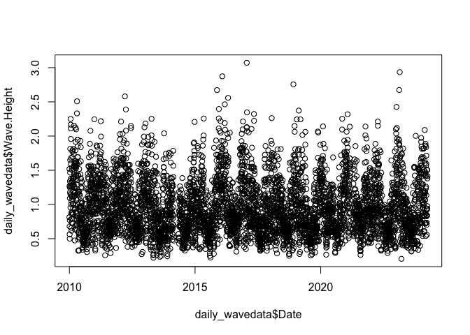<!-- -->

``` r
plot(daily_wavedata$Date, daily_wavedata$Water.Temp)
```

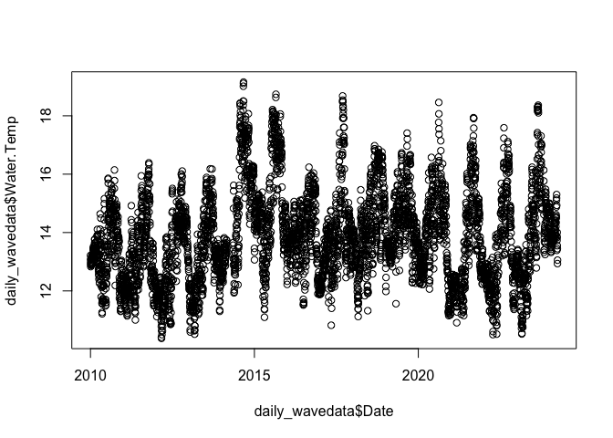<!-- -->

### Raw Data Figures

##### Fig S1E - Wave Height Raw Data

Daily Average Wave Height over Time

``` r
FigS1E <- daily_wavedata %>% 
  subset(Year > 2013) %>%
  ggplot(mapping=aes(x = Date, y = Wave.Height)) + 
      labs (x = "Date", y = "Wave Height (m)") +  
      theme(panel.background = element_blank(), 
          axis.line = element_line (colour = "black"), 
          axis.text = element_text(size = 32),
                axis.text.x = element_text(angle = 0, hjust = 0.5),
          axis.title = element_text(size = 36)) + 
      geom_point (size=3,alpha = 0.7)+ 
      theme(plot.title = element_text(hjust = 0.5, size=35, face="bold"))

FigS1E
```

    ## Warning: Removed 1 row containing missing values or values outside the scale range
    ## (`geom_point()`).

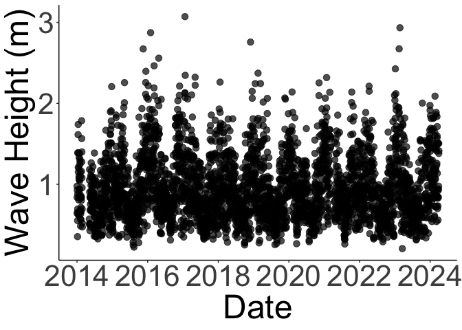<!-- -->

``` r
#ggsave(here("Figures", "figS1E.png", height=3, width=3, scale = 3))
```

##### Fig S1F - Water Temperature Raw Data

Daily Average Water Temperature over Time

``` r
FigS1F <- daily_wavedata %>% 
  subset(Year > 2013) %>%
  ggplot(mapping=aes(x = Date, y = Water.Temp)) + 
      labs (x = "Date", y = "Water Temperature (°C)") + 
      theme(panel.background = element_blank(), 
          axis.line = element_line (colour = "black"), 
          axis.text = element_text(size = 32),
                axis.text.x = element_text(angle = 0, hjust = 0.5),
          axis.title = element_text(size = 36)) + 
      geom_point (size=3, alpha = 0.7) + 
      scale_y_continuous(breaks = c(10, 13, 16, 19)) +
      theme(plot.title = element_text(hjust = 0.5, size=30, face="bold"))

FigS1F
```

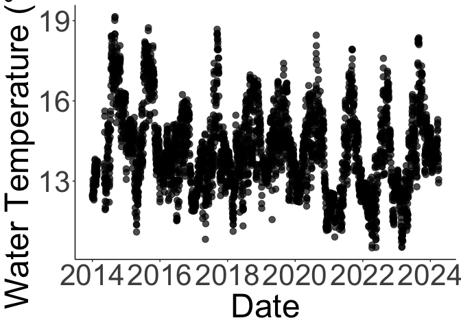<!-- -->

``` r
#ggsave(here("Figures", "figS1F.png", height=3, width=3, scale = 3))
```

## Models

Importing the csv made in the Models script, where the wave data was
averaged for each of the 3 months preceding each mussel data collection
date

``` r
waves_avg <- read.csv(here("Data", "Data for Models", "mussels.abiotic.csv"))
```

Turn Date into Date format (Year-month-day)

``` r
waves_avg$Date <- as.Date(waves_avg$Date)
```

``` r
waves_avg <- waves_avg %>% mutate(date_dec = decimal_date(Date))
```

#### Wave Height

``` r
# THIS IS THE MODEL WE'RE USING
wht.m1 <- lm(Wave.Height ~ date_dec, data = waves_avg)
summary(wht.m1)
```

    ## 
    ## Call:
    ## lm(formula = Wave.Height ~ date_dec, data = waves_avg)
    ## 
    ## Residuals:
    ##      Min       1Q   Median       3Q      Max 
    ## -0.23088 -0.10801 -0.06001  0.11205  0.39218 
    ## 
    ## Coefficients:
    ##               Estimate Std. Error t value Pr(>|t|)
    ## (Intercept) -16.741645  21.671183  -0.773    0.447
    ## date_dec      0.008779   0.010737   0.818    0.421
    ## 
    ## Residual standard error: 0.1539 on 25 degrees of freedom
    ##   (1 observation deleted due to missingness)
    ## Multiple R-squared:  0.02604,    Adjusted R-squared:  -0.01292 
    ## F-statistic: 0.6685 on 1 and 25 DF,  p-value: 0.4213

``` r
acf(residuals(wht.m1)) 
```

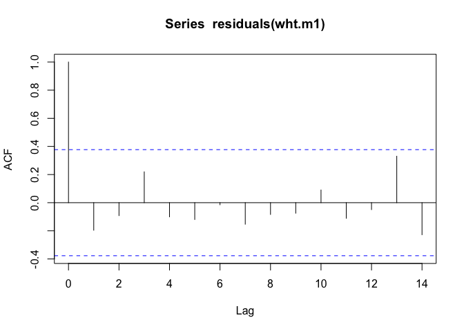<!-- -->

``` r
tidy(wht.m1)
```

    ## # A tibble: 2 × 5
    ##   term         estimate std.error statistic p.value
    ##   <chr>           <dbl>     <dbl>     <dbl>   <dbl>
    ## 1 (Intercept) -16.7       21.7       -0.773   0.447
    ## 2 date_dec      0.00878    0.0107     0.818   0.421

``` r
resid_panel(wht.m1)
```

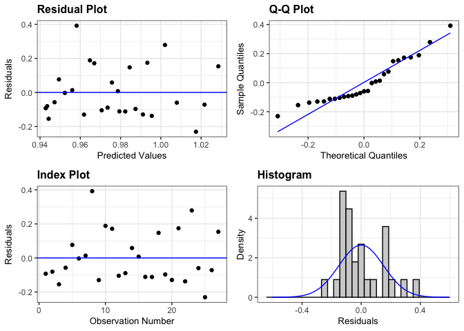<!-- -->

``` r
plot(wht.m1, 3)
```

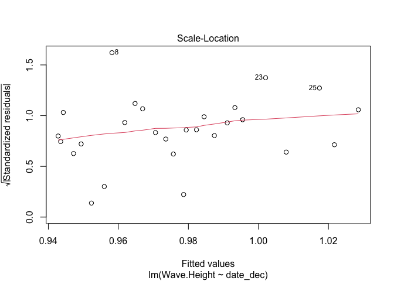<!-- -->

``` r
ncvTest(wht.m1)
```

    ## Non-constant Variance Score Test 
    ## Variance formula: ~ fitted.values 
    ## Chisquare = 0.1678861, Df = 1, p = 0.682

``` r
whtgam1 <- gam(Wave.Height ~ date_dec, data = waves_avg, method = "ML")
whtgam1_summary <- summary(whtgam1)
whtgam1_summary$p.table
```

    ##                  Estimate  Std. Error    t value  Pr(>|t|)
    ## (Intercept) -16.741644570 21.67118288 -0.7725303 0.4470429
    ## date_dec      0.008778956  0.01073734  0.8176102 0.4213041

``` r
whtgam1_summary$s.table
```

    ## NULL

``` r
par(mfrow = c(1, 2))
plot(whtgam1, all.terms = TRUE)
acf(residuals(whtgam1)) 
```

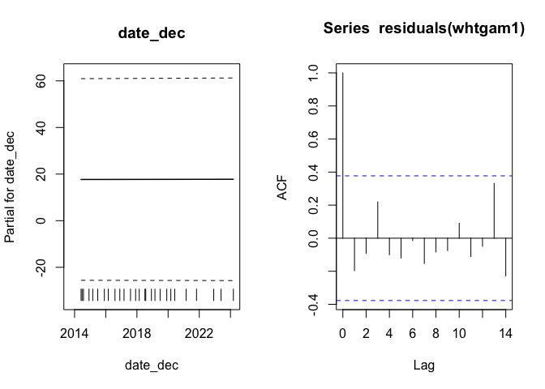<!-- -->

``` r
AIC(wht.m1, whtgam1) # lower AIC = better performing model --> equal
```

    ##         df       AIC
    ## wht.m1   3 -20.51105
    ## whtgam1  3 -20.51105

``` r
#so we're keeping the linear model
```

##### Plot with Model Data

\######Fig2E - Wave Height Model Data

``` r
Fig2E <- waves_avg %>% 
  ggplot(aes(date_dec, Wave.Height)) + 
  geom_smooth(method = "lm", fill = "gray79", color = "gray25") + 
  geom_point(size = 5, alpha = 0.7, pch = 21, fill = "black") +
  theme_minimal() +
  theme(panel.background = element_blank(), 
        axis.line = element_line (colour = "black"),
        axis.text.y = element_text(size =25),
        axis.text.x = element_text(angle = 0, hjust = 0.5, size = 25),
        axis.text = element_text(size = 25),
        axis.title = element_text(size = 25)) + 
  labs(x = "Date", y = "Wave Height (m)") 

Fig2E
```

    ## `geom_smooth()` using formula = 'y ~ x'

    ## Warning: Removed 1 row containing non-finite outside the scale range
    ## (`stat_smooth()`).

    ## Warning: Removed 1 row containing missing values or values outside the scale range
    ## (`geom_point()`).

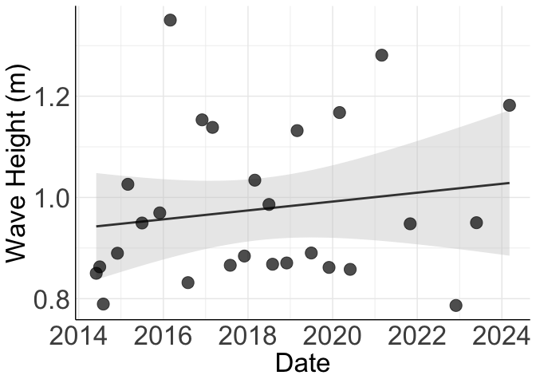<!-- -->

``` r
#ggsave(here("Figures", "Fig2E.png", height=3, width=3, scale=3))
```

#### Water Temperature

``` r
# THIS IS THE MODEL WE'RE USING
wtmp.m1 <- lm(Water.Temp ~ date_dec, data = waves_avg)
summary(wtmp.m1)
```

    ## 
    ## Call:
    ## lm(formula = Water.Temp ~ date_dec, data = waves_avg)
    ## 
    ## Residuals:
    ##      Min       1Q   Median       3Q      Max 
    ## -2.00856 -0.75860 -0.03688  0.60212  2.22442 
    ## 
    ## Coefficients:
    ##              Estimate Std. Error t value Pr(>|t|)
    ## (Intercept)  93.49649  141.97975   0.659    0.516
    ## date_dec     -0.03933    0.07034  -0.559    0.581
    ## 
    ## Residual standard error: 1.081 on 26 degrees of freedom
    ## Multiple R-squared:  0.01188,    Adjusted R-squared:  -0.02612 
    ## F-statistic: 0.3126 on 1 and 26 DF,  p-value: 0.5809

``` r
acf(residuals(wtmp.m1)) 
```

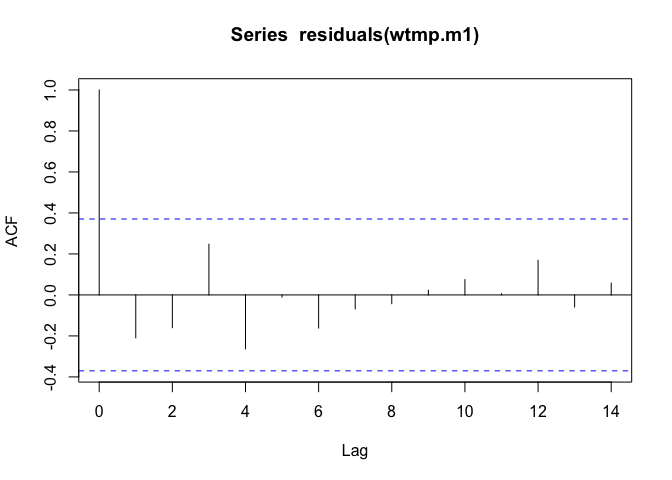<!-- -->

``` r
tidy(wtmp.m1)
```

    ## # A tibble: 2 × 5
    ##   term        estimate std.error statistic p.value
    ##   <chr>          <dbl>     <dbl>     <dbl>   <dbl>
    ## 1 (Intercept)  93.5     142.         0.659   0.516
    ## 2 date_dec     -0.0393    0.0703    -0.559   0.581

``` r
resid_panel(wtmp.m1)
```

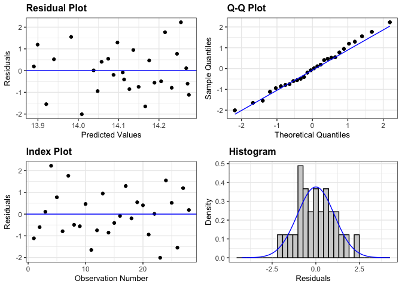<!-- -->

``` r
plot(wtmp.m1, 3)
```

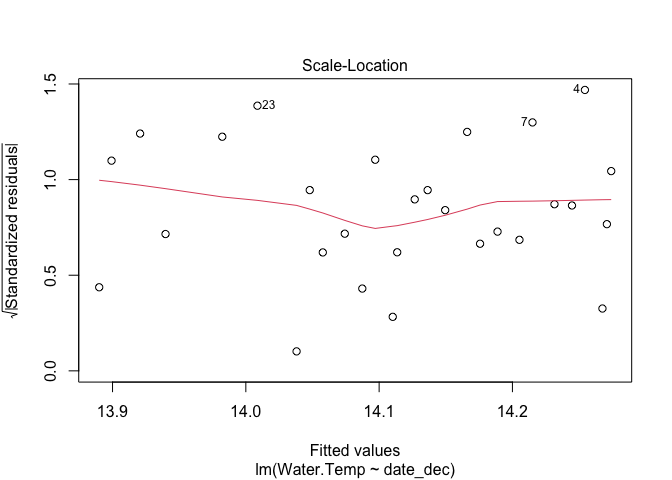<!-- -->

``` r
ncvTest(wtmp.m1)
```

    ## Non-constant Variance Score Test 
    ## Variance formula: ~ fitted.values 
    ## Chisquare = 0.0002083435, Df = 1, p = 0.98848

``` r
wtmpgam1 <- gam(Water.Temp ~ date_dec, data = waves_avg, method = "ML")
wtmpgam1_summary <- summary(wtmpgam1)
wtmpgam1_summary$p.table
```

    ##                Estimate   Std. Error    t value  Pr(>|t|)
    ## (Intercept) 93.49649379 141.97974729  0.6585199 0.5159937
    ## date_dec    -0.03932777   0.07033912 -0.5591166 0.5808667

``` r
wtmpgam1_summary$s.table
```

    ## NULL

``` r
par(mfrow = c(1, 2))
plot(wtmpgam1, all.terms = TRUE)
acf(residuals(wtmpgam1)) 
```

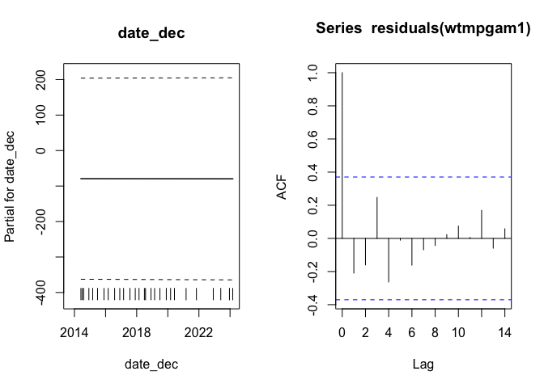<!-- -->

``` r
AIC(wtmp.m1, wtmpgam1) # lower AIC = better performing model --> equal
```

    ##          df     AIC
    ## wtmp.m1   3 87.7478
    ## wtmpgam1  3 87.7478

``` r
# so we're using the linear model
```

##### Plot with Model Data

###### Fig 2F - Water Temperature Model Data

``` r
Fig2F <- waves_avg %>% 
  ggplot(aes(date_dec, Water.Temp)) + 
  geom_smooth(method = "lm", fill = "gray79", color = "gray25") + 
  geom_point(size = 5, alpha = 0.7, pch = 21, fill = "black") +
  theme_minimal() +
  theme(panel.background = element_blank(), 
        axis.line = element_line (colour = "black"), 
        axis.text.x = element_text(angle = 0, hjust = 0.5),
        axis.text = element_text(size = 25),
        axis.title = element_text(size = 25)) + 
  labs(x = "Date", y = "Water Temperature (°C)") 

Fig2F
```

    ## `geom_smooth()` using formula = 'y ~ x'

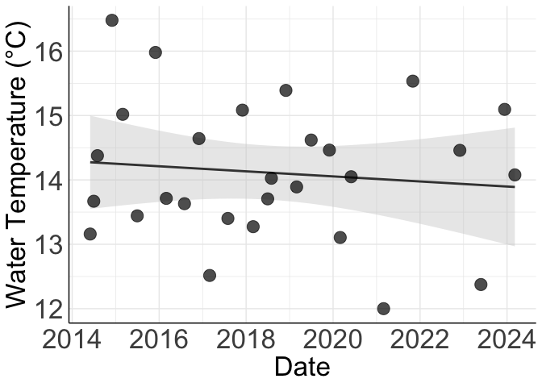<!-- -->

``` r
#ggsave(here("Figures", "Fig2F.png", height=3, width=3, scale=3))
```
