Predators_Data
================
Micaela Chapuis
2024-07-12

``` r
library(here)
```

    ## here() starts at /Users/micachapuis/GitHub/Recent_changes_in_mussel_beds_following_mass_mortality_of_a_keystone_marine_predator

``` r
library(tidyverse)
```

    ## ── Attaching core tidyverse packages ──────────────────────── tidyverse 2.0.0 ──
    ## ✔ dplyr     1.1.4     ✔ readr     2.1.5
    ## ✔ forcats   1.0.0     ✔ stringr   1.5.1
    ## ✔ ggplot2   3.5.1     ✔ tibble    3.2.1
    ## ✔ lubridate 1.9.4     ✔ tidyr     1.3.1
    ## ✔ purrr     1.0.2

    ## ── Conflicts ────────────────────────────────────────── tidyverse_conflicts() ──
    ## ✖ dplyr::filter() masks stats::filter()
    ## ✖ dplyr::lag()    masks stats::lag()
    ## ℹ Use the conflicted package (<http://conflicted.r-lib.org/>) to force all conflicts to become errors

``` r
library(lubridate)
library(mgcv)
```

    ## Loading required package: nlme
    ## 
    ## Attaching package: 'nlme'
    ## 
    ## The following object is masked from 'package:dplyr':
    ## 
    ##     collapse
    ## 
    ## This is mgcv 1.9-1. For overview type 'help("mgcv-package")'.

``` r
library(broom)
library(ggResidpanel)
library(car)
```

    ## Loading required package: carData
    ## 
    ## Attaching package: 'car'
    ## 
    ## The following object is masked from 'package:dplyr':
    ## 
    ##     recode
    ## 
    ## The following object is masked from 'package:purrr':
    ## 
    ##     some

## Whelks

``` r
whelk <- read.csv(here("Data", "whelk_data.csv"))
```

### Data Cleaning

Recode “28 + whelk eggs” data point to just “28” and switch Number to
numeric

``` r
whelk$Number <- dplyr::recode(whelk$Number, "28 + whelk eggs" = "28")
whelk$Number <- as.numeric(whelk$Number)
```

Recode Date column + turn into Date format (changing 15-Jul-14 to
14-Jul-14 to combine those)

``` r
whelk$Date <- dplyr::recode(whelk$Date, "6/18/2014" = "2014-06-18", "6/19/2014" = "2014-06-19", "6/27/2014" = "2014-06-27", "7/15/2014" = "2014-07-14", "7/14/2014" = "2014-07-14", "8/11/2014" = "2014-08-11", "10/1/2015" = "2015-10-01", "7/14/2017" = "2017-07-14", "5/17/2021" = "2021-05-17", "7/7/2023" = "2023-07-07", "12/12/2023" = "2023-12-12", "3/8/2024" = "2024-03-08")
whelk$Date <- as.Date(whelk$Date)
```

Fix name of “Plot” column

``` r
names(whelk)[3] <- "Plot"
```

Change name of “Number” column to be more descriptive

``` r
names(whelk)[4] <- "Num.Whelks"
```

Filter out B plots and making new df “whelks” without them (Whelk
quadrats, which are smaller than mussel quadrats, were supposed to be
put in between the A and B plots, right on their shared border. At some
point, people collected whelk data for the A and the B plots separately.
We chose to only keep the A plots since not all plots have B plots)

``` r
B.plots <- c("1B", "2B", "3B", "5B", "6B", "7B", "9B", "10B")
whelks <- whelk %>% filter(!Plot %in% B.plots)
```

Recode A plots to WholePlot numbers

``` r
whelks$Plot <- dplyr::recode(whelks$Plot, "1A" = "1", "2A" = "2", "3A" = "3", "4A" = "4", "5A" = "5", "6A" = "6", "7A" = "7", "8A" = "8", "9A" = "9", "10A" = "10")
```

Change Date to date and Site and Plot to factor

``` r
whelks$Date <- as.Date(whelks$Date, "%Y-%m-%d")
whelks$Site <- as.factor(whelks$Site)
whelks$Plot <- as.factor(whelks$Plot)
```

Create column for just year

``` r
whelks$Year <- year(whelks$Date)
```

### Raw Data Figure

``` r
group.colors <- c(West = "#ff6361", East = "#619eff")
```

###### Fig S1D - Whelk Abundance Raw Data

``` r
FigS1D <- whelks %>% 
  ggplot(mapping=aes(x = Date, y = Num.Whelks, color = Site)) + 
      labs (x = "Date", y = "Whelk Abundance (# whelks/0.25m2") + 
      theme(panel.background = element_blank(), 
          axis.line = element_line (colour = "black"), 
          axis.text = element_text(size = 32),
                axis.text.x = element_text(angle = 0, hjust = 0.5),
          axis.title = element_text(size = 36),
          legend.position = "none") + 
      geom_point (size=4, alpha = 0.7) + 
      scale_x_date(limits = as.Date(c("2014-01-01", "2024-04-01"))) +
    theme(plot.title = element_text(hjust = 0.5, size=30, face="bold"))+
  scale_color_manual(values=group.colors) +
  scale_fill_manual(values=group.colors) 

FigS1D
```

    ## Warning: No shared levels found between `names(values)` of the manual scale and the
    ## data's fill values.

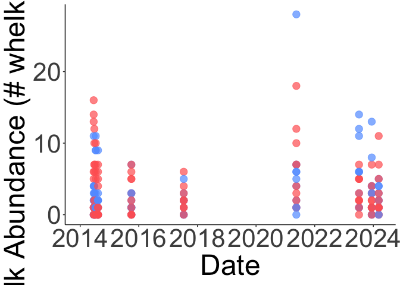<!-- -->

``` r
#ggsave(here("Figures", "figS1D.png", height=3, width=3, scale = 3))
```

## Seastars

Long term data (1954-2024)

``` r
seastars <- read.csv(here("Data", "seastar_data.csv"))
```

Changing name of Count column to Num.Seastars

``` r
names(seastars)[3] <- "Num.Seastars"
```

### Raw Data Figure

\#####FigS1C - Seastar Abundace Raw Data (2014-2024)

``` r
FigS1C <- seastars %>% 
  subset(Year>2013) %>%
  ggplot(mapping=aes(x = Year, y = Num.Seastars, color = Site)) + 
  labs (x = "Date", y = "Sea Star Abundance (# sea stars/site)") + 
  theme(panel.background = element_blank(), 
        axis.line = element_line (colour = "black"), 
        axis.text = element_text(size = 32),
              axis.text.x = element_text(angle = 0, hjust = 0.5),
        axis.title = element_text(size = 36),
        legend.text = element_text(size = 32),
        legend.title = element_text(size = 36)) + 
  geom_point (size=4, alpha = 0.7, position="jitter") + 
  theme(plot.title = element_text(hjust = 0.5, size=35, face="bold")) +
  scale_x_continuous(breaks = c(2014, 2016, 2018, 2020, 2022, 2024)) +
  scale_color_manual(values=group.colors) +
  scale_fill_manual(values=group.colors)

FigS1C
```

    ## Warning: No shared levels found between `names(values)` of the manual scale and the
    ## data's fill values.

    ## Warning: Removed 1 row containing missing values or values outside the scale range
    ## (`geom_point()`).

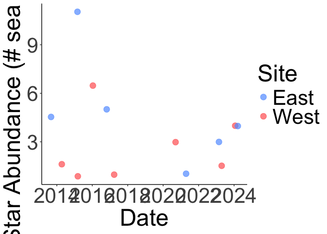<!-- -->

``` r
#ggsave(here("Figures", "figS1C.png", height=3, width=3, scale = 3))
```

## Models

#### Seastars

2014-2024

``` r
sd <- seastars %>% filter(Year > 2013)
#write.csv(sd, file = here("Data", "Data for Models, "seastars_avg.csv"), row.names = FALSE)  #to be used in the models script
```

Most of the code from here on (within this section) was written by Robin
Elahi

Following this: <https://rpubs.com/markpayne/164550>

``` r
#with Year * Site interaction
stars.m1 <- lm(Num.Seastars ~ Year * Site, data = sd)
summary(stars.m1)
```

    ## 
    ## Call:
    ## lm(formula = Num.Seastars ~ Year * Site, data = sd)
    ## 
    ## Residuals:
    ##     Min      1Q  Median      3Q     Max 
    ## -2.8056 -1.4933 -0.6944  0.9778  4.3611 
    ## 
    ## Coefficients:
    ##                 Estimate Std. Error t value Pr(>|t|)
    ## (Intercept)     958.1667   555.4492   1.725    0.119
    ## Year             -0.4722     0.2751  -1.716    0.120
    ## SiteWest      -1096.5877   769.7855  -1.425    0.188
    ## Year:SiteWest     0.5421     0.3813   1.422    0.189
    ## 
    ## Residual standard error: 2.61 on 9 degrees of freedom
    ##   (1 observation deleted due to missingness)
    ## Multiple R-squared:  0.3627, Adjusted R-squared:  0.1503 
    ## F-statistic: 1.707 on 3 and 9 DF,  p-value: 0.2346

``` r
acf(residuals(stars.m1)) 
```

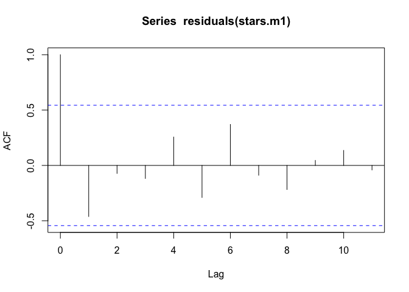<!-- -->

``` r
# THIS IS THE MODEL WE CHOSE
# without Year * Site interaction
stars.m2 <- lm(Num.Seastars ~ Year + Site, data = sd)
summary(stars.m2)
```

    ## 
    ## Call:
    ## lm(formula = Num.Seastars ~ Year + Site, data = sd)
    ## 
    ## Residuals:
    ##     Min      1Q  Median      3Q     Max 
    ## -3.3699 -1.9116 -0.3013  0.8186  5.4899 
    ## 
    ## Coefficients:
    ##             Estimate Std. Error t value Pr(>|t|)
    ## (Intercept)  388.421    403.769   0.962    0.359
    ## Year          -0.190      0.200  -0.950    0.364
    ## SiteWest      -2.189      1.527  -1.433    0.182
    ## 
    ## Residual standard error: 2.74 on 10 degrees of freedom
    ##   (1 observation deleted due to missingness)
    ## Multiple R-squared:  0.2196, Adjusted R-squared:  0.0635 
    ## F-statistic: 1.407 on 2 and 10 DF,  p-value: 0.2895

``` r
acf(residuals(stars.m2)) 
```

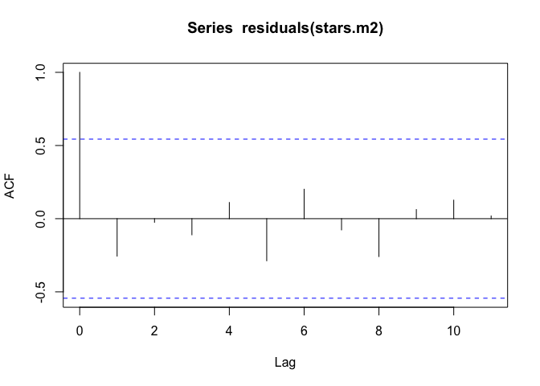<!-- -->

``` r
tidy(stars.m2)
```

    ## # A tibble: 3 × 5
    ##   term        estimate std.error statistic p.value
    ##   <chr>          <dbl>     <dbl>     <dbl>   <dbl>
    ## 1 (Intercept)  388.      404.        0.962   0.359
    ## 2 Year          -0.190     0.200    -0.950   0.364
    ## 3 SiteWest      -2.19      1.53     -1.43    0.182

``` r
resid_panel(stars.m2)
```

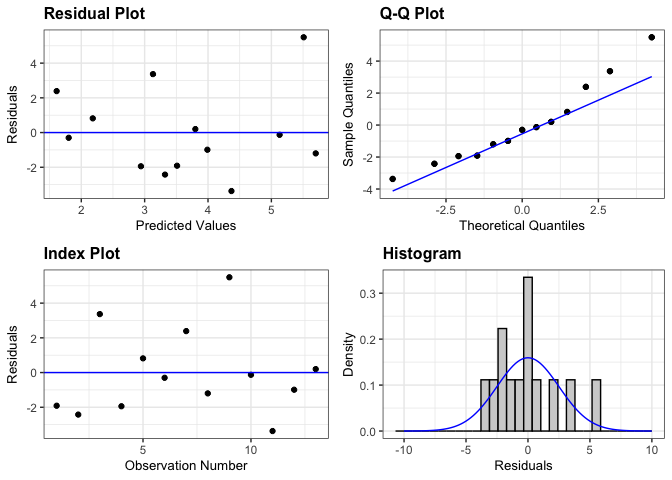<!-- -->

``` r
plot(stars.m2, 3)
```

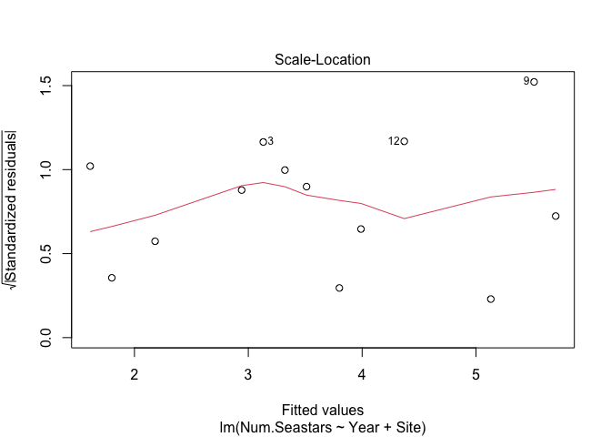<!-- -->

``` r
ncvTest(stars.m2)
```

    ## Non-constant Variance Score Test 
    ## Variance formula: ~ fitted.values 
    ## Chisquare = 1.526957, Df = 1, p = 0.21657

``` r
glimpse(sd)
```

    ## Rows: 14
    ## Columns: 3
    ## $ Year         <int> 2014, 2015, 2016, 2017, 2021, 2023, 2024, 2014, 2015, 201…
    ## $ Site         <chr> "West", "West", "West", "West", "West", "West", "West", "…
    ## $ Num.Seastars <dbl> 1.6, 0.9, 6.5, 1.0, 3.0, 1.5, 4.0, 4.5, 11.0, NA, 5.0, 1.…

``` r
sd <- sd %>% 
  mutate(Site = as.factor(Site))
sd
```

    ##    Year Site Num.Seastars
    ## 1  2014 West          1.6
    ## 2  2015 West          0.9
    ## 3  2016 West          6.5
    ## 4  2017 West          1.0
    ## 5  2021 West          3.0
    ## 6  2023 West          1.5
    ## 7  2024 West          4.0
    ## 8  2014 East          4.5
    ## 9  2015 East         11.0
    ## 10 2016 East           NA
    ## 11 2017 East          5.0
    ## 12 2021 East          1.0
    ## 13 2023 East          3.0
    ## 14 2024 East          4.0

GAMS

``` r
## No interaction between date and site
sgam1 <- gam(Num.Seastars ~ Year + Site, data = sd, method = "ML") # won't run with smoothed year
sgam1_summary <- summary(sgam1)
sgam1_summary$p.table
```

    ##                Estimate  Std. Error    t value  Pr(>|t|)
    ## (Intercept) 388.4214612 403.7686659  0.9619901 0.3587387
    ## Year         -0.1900304   0.1999837 -0.9502296 0.3643957
    ## SiteWest     -2.1885845   1.5267773 -1.4334668 0.1822413

``` r
sgam1_summary$s.table
```

    ## NULL

``` r
par(mfrow = c(1, 2))
plot(sgam1, all.terms = TRUE)
```

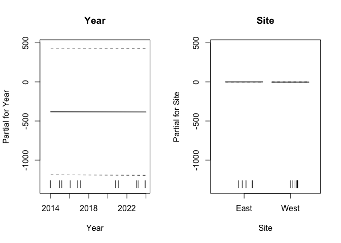<!-- -->

``` r
acf(residuals(sgam1)) 
```

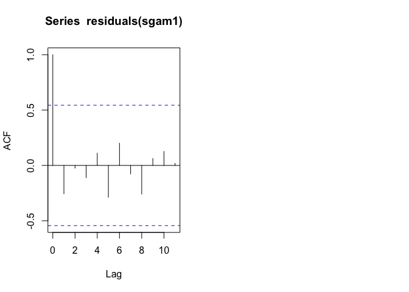<!-- -->

``` r
## Compare models - "Generally, the smaller the AIC, the “better” is the predictive performance of the model."
# Here we compare the linear model to the GAM

AIC(stars.m2, sgam1) # lower AIC = better performing model --> they're the same
```

    ##          df      AIC
    ## stars.m2  4 67.68814
    ## sgam1     4 67.68814

``` r
#so sticking with the linear model
```

##### Plot with Model Data

\######Fig2C - Seastars Model Data

``` r
Fig2C <- sd %>% 
  ggplot(aes(Year, Num.Seastars, color = Site, fill = Site)) + 
  geom_smooth(method = "lm", aes(group=NULL), fill = "gray79", color = "gray25") + 
  geom_point(size = 5, alpha = 0.7, pch = 21, color = "black") +
  theme_minimal() + 
  theme(panel.background = element_blank(), 
        axis.line = element_line (colour = "black"), 
        axis.text.x = element_text(angle = 0, hjust = 0.5),
        axis.text = element_text(size = 25),
        axis.title = element_text(size = 25),
        legend.position = "none") +
  labs(x = "Year", y = "Sea Star Abundance") +
  scale_x_continuous(breaks = c(2014, 2016, 2018, 2020, 2022, 2024)) +
  scale_color_manual(values=group.colors) +
  scale_fill_manual(values=group.colors) 

Fig2C
```

    ## `geom_smooth()` using formula = 'y ~ x'

    ## Warning: Removed 1 row containing non-finite outside the scale range
    ## (`stat_smooth()`).

    ## Warning: No shared levels found between `names(values)` of the manual scale and the
    ## data's colour values.

    ## Warning: Removed 1 row containing missing values or values outside the scale range
    ## (`geom_point()`).

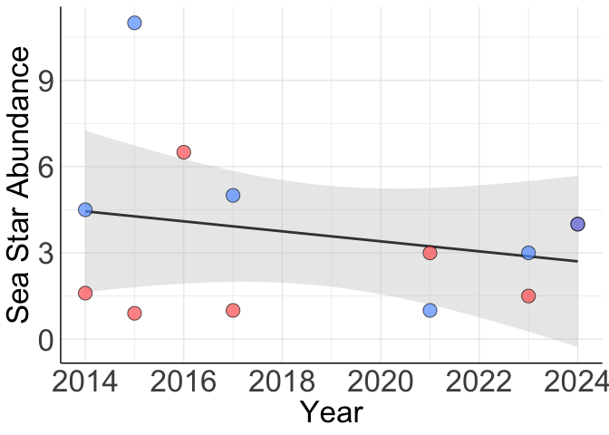<!-- -->

``` r
#ggsave(here("Figures", "Fig2C.png", height=3, width=3, scale=3))
```

\####Long Term Seastars

``` r
lt_stars <- seastars %>% group_by(Year,Site) %>% summarize(Num.Seastars = mean(Num.Seastars))
```

    ## `summarise()` has grouped output by 'Year'. You can override using the
    ## `.groups` argument.

\######Fig 3 - Long Term Seastar Abundance

``` r
Fig3 <- lt_stars %>% 
  ggplot(aes(Year, Num.Seastars, color = Site, fill = Site)) + 
  geom_smooth(method = "lm", aes(group=NULL), fill = "gray79", color = "gray25") + 
  geom_point(size = 5, alpha = 0.7, pch = 21, color = "black") +
  theme_minimal() + 
  theme(panel.background = element_rect(color="white"),
        axis.line = element_line (colour = "black"), 
        axis.text.x = element_text(angle = 30, hjust = 0.8),
        axis.text = element_text(size = 25),
        axis.title = element_text(size = 25),
        legend.text = element_text(size = 20),
        legend.title = element_text(size = 25),
        legend.background = element_rect(color=NA)) +
  labs(x = "Year", y = "Sea Star Abundance") +
  scale_color_manual(values=group.colors) +
  scale_fill_manual(values=group.colors) +
  scale_x_discrete(limits = c(1954, 1970, 1985, 1995, 2004, 2014, 2024))
```

    ## Warning in scale_x_discrete(limits = c(1954, 1970, 1985, 1995, 2004, 2014, : Continuous limits supplied to discrete scale.
    ## ℹ Did you mean `limits = factor(...)` or `scale_*_continuous()`?

``` r
Fig3
```

    ## `geom_smooth()` using formula = 'y ~ x'

    ## Warning: Removed 3 rows containing non-finite outside the scale range
    ## (`stat_smooth()`).

    ## Warning: No shared levels found between `names(values)` of the manual scale and the
    ## data's colour values.

    ## Warning: Removed 3 rows containing missing values or values outside the scale range
    ## (`geom_point()`).

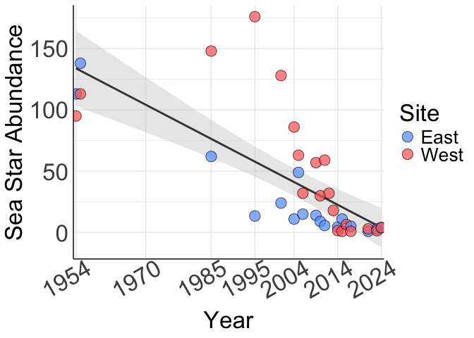<!-- -->

``` r
#ggsave(here("Figures", "Fig3.pdf", height=3, width=4, scale=2.5, bg="white"))
```

#### Whelks

Averaging Whelks to Site and Year to match Seastars

``` r
wd <- whelks %>% group_by(Site, Year) %>% summarize(Num.Whelks = mean(Num.Whelks))
```

    ## `summarise()` has grouped output by 'Site'. You can override using the
    ## `.groups` argument.

``` r
#write.csv(wd, file = "whelks_avg.csv", row.names = FALSE)  #to use in models script
```

Most of the code from here on was written by Robin Elahi Following this:
<https://rpubs.com/markpayne/164550>

``` r
#with Year*Site interaction
whelks.m1 <- lm(Num.Whelks ~ Year * Site, data = wd)
summary(whelks.m1)
```

    ## 
    ## Call:
    ## lm(formula = Num.Whelks ~ Year * Site, data = wd)
    ## 
    ## Residuals:
    ##     Min      1Q  Median      3Q     Max 
    ## -1.9917 -1.0448 -0.5199  0.6465  2.8478 
    ## 
    ## Coefficients:
    ##                Estimate Std. Error t value Pr(>|t|)
    ## (Intercept)   -422.4350   364.7827  -1.158    0.280
    ## Year             0.2108     0.1807   1.167    0.277
    ## SiteWest       356.4750   515.8806   0.691    0.509
    ## Year:SiteWest   -0.1764     0.2555  -0.690    0.510
    ## 
    ## Residual standard error: 1.714 on 8 degrees of freedom
    ## Multiple R-squared:  0.1597, Adjusted R-squared:  -0.1554 
    ## F-statistic: 0.5067 on 3 and 8 DF,  p-value: 0.6885

``` r
acf(residuals(whelks.m1)) 
```

<!-- -->

``` r
#THIS IS THE MODEL WE CHOSE
#without Year*Site interaction
whelks.m2 <- lm(Num.Whelks ~ Year + Site, data = wd)
summary(whelks.m2)
```

    ## 
    ## Call:
    ## lm(formula = Num.Whelks ~ Year + Site, data = wd)
    ## 
    ## Residuals:
    ##     Min      1Q  Median      3Q     Max 
    ## -1.5507 -1.1455 -0.5199  1.0654  2.6714 
    ## 
    ## Coefficients:
    ##              Estimate Std. Error t value Pr(>|t|)
    ## (Intercept) -244.3704   250.3275  -0.976    0.354
    ## Year           0.1226     0.1240   0.989    0.348
    ## SiteWest       0.3458     0.9604   0.360    0.727
    ## 
    ## Residual standard error: 1.663 on 9 degrees of freedom
    ## Multiple R-squared:  0.1096, Adjusted R-squared:  -0.08824 
    ## F-statistic: 0.554 on 2 and 9 DF,  p-value: 0.593

``` r
acf(residuals(whelks.m2)) 
```

<!-- -->

``` r
tidy(whelks.m2)
```

    ## # A tibble: 3 × 5
    ##   term        estimate std.error statistic p.value
    ##   <chr>          <dbl>     <dbl>     <dbl>   <dbl>
    ## 1 (Intercept) -244.      250.       -0.976   0.354
    ## 2 Year           0.123     0.124     0.989   0.348
    ## 3 SiteWest       0.346     0.960     0.360   0.727

``` r
resid_panel(whelks.m2)
```

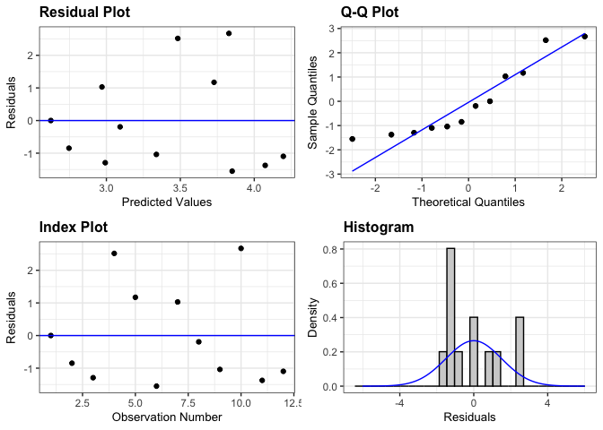<!-- -->

``` r
plot(whelks.m2, 3)
```

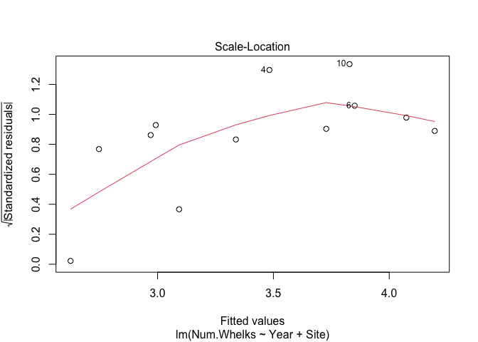<!-- -->

``` r
ncvTest(whelks.m2)
```

    ## Non-constant Variance Score Test 
    ## Variance formula: ~ fitted.values 
    ## Chisquare = 1.105959, Df = 1, p = 0.29296

``` r
AIC(whelks.m1, whelks.m2) #without the interaction = better
```

    ##           df      AIC
    ## whelks.m1  5 52.12127
    ## whelks.m2  4 50.81563

``` r
glimpse(wd)
```

    ## Rows: 12
    ## Columns: 3
    ## Groups: Site [2]
    ## $ Site       <fct> East, East, East, East, East, East, West, West, West, West,…
    ## $ Year       <dbl> 2014, 2015, 2017, 2021, 2023, 2024, 2014, 2015, 2017, 2021,…
    ## $ Num.Whelks <dbl> 2.625, 1.900, 1.700, 6.000, 4.900, 2.300, 4.000, 2.900, 2.3…

``` r
wd <- wd %>% 
  mutate(Site = as.factor(Site))
wd
```

    ## # A tibble: 12 × 3
    ## # Groups:   Site [2]
    ##    Site   Year Num.Whelks
    ##    <fct> <dbl>      <dbl>
    ##  1 East   2014       2.62
    ##  2 East   2015       1.9 
    ##  3 East   2017       1.7 
    ##  4 East   2021       6   
    ##  5 East   2023       4.9 
    ##  6 East   2024       2.3 
    ##  7 West   2014       4   
    ##  8 West   2015       2.9 
    ##  9 West   2017       2.3 
    ## 10 West   2021       6.5 
    ## 11 West   2023       2.7 
    ## 12 West   2024       3.1

``` r
## No interaction between date and site
wgam1 <- gam(Num.Whelks ~ Year + Site, data = wd, method = "ML") # won't run with smoothed year
wgam1_summary <- summary(wgam1)
wgam1_summary$p.table
```

    ##                 Estimate  Std. Error    t value  Pr(>|t|)
    ## (Intercept) -244.3704167 250.3275076 -0.9762028 0.3544717
    ## Year           0.1226389   0.1239854  0.9891395 0.3484404
    ## SiteWest       0.3458333   0.9603870  0.3600979 0.7270797

``` r
wgam1_summary$s.table
```

    ## NULL

``` r
par(mfrow = c(1, 2))
plot(wgam1, all.terms = TRUE)
```

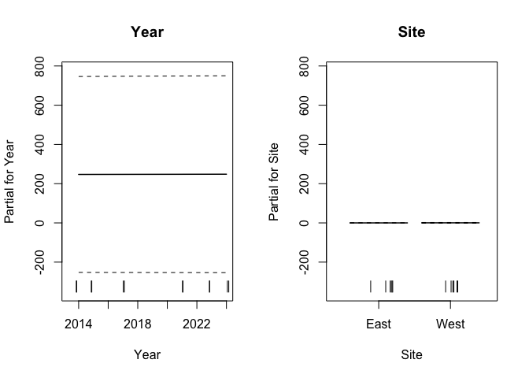<!-- -->

``` r
acf(residuals(wgam1)) 
```

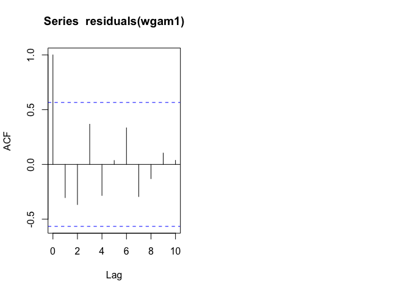<!-- -->

``` r
## Compare models - "Generally, the smaller the AIC, the “better” is the predictive performance of the model."
# Here we compare Linear model and GAM

AIC(whelks.m2, wgam1) # lower AIC = better performing model --> equal
```

    ##           df      AIC
    ## whelks.m2  4 50.81563
    ## wgam1      4 50.81563

``` r
#so we're using the linear model
```

##### Plot with Model Data

\######Fig2D - Whelks Model Data

``` r
Fig2D <- wd %>% 
  ggplot(aes(Year, Num.Whelks, color = Site, fill = Site)) + 
  geom_smooth(method = "lm", aes(group=NULL), fill = "gray79", color = "gray25") + 
  geom_point(size = 5, alpha = 0.7, pch = 21, color = "black") +
  theme_minimal() +
  theme(panel.background = element_blank(), 
        axis.line = element_line (colour = "black"), 
        axis.text.x = element_text(angle = 0, hjust = 0.5),
        axis.text = element_text(size = 25),
        axis.title = element_text(size = 25),
        legend.position = "none") + 
  labs(x = "Year", y = "Whelk Abundance") +
  scale_x_continuous(breaks = c(2014, 2016, 2018, 2020, 2022, 2024)) +
  scale_color_manual(values=group.colors) +
  scale_fill_manual(values=group.colors)

Fig2D
```

    ## `geom_smooth()` using formula = 'y ~ x'

    ## Warning: No shared levels found between `names(values)` of the manual scale and the
    ## data's colour values.

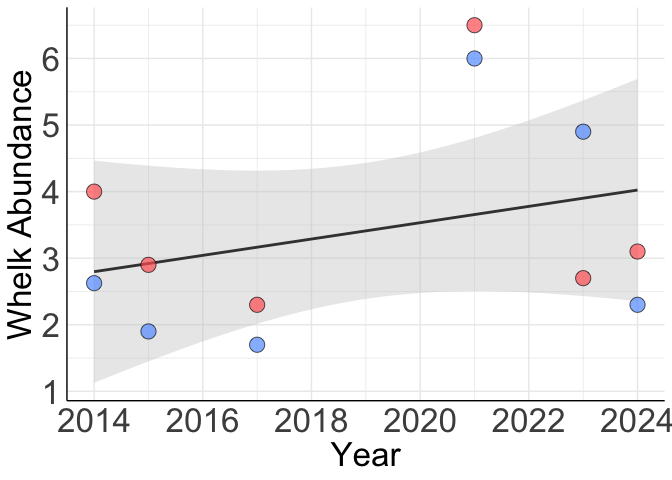<!-- -->

``` r
#ggsave(here("Figures", "Fig2D.png", height=3, width=3, scale=3))
```
